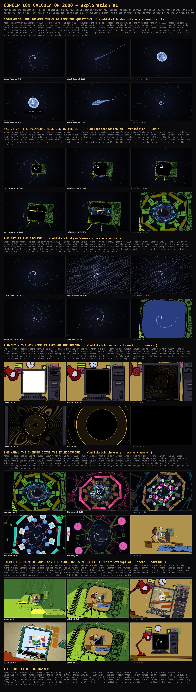

# Exploration 01: new scenes and transitions

Discovery, not a cut. Four scouts proposed twenty-four scene and transition ideas for the run, each through a different lens (the joins between beats; what the archive data affords; the swimmer and the lens; optical and analogue devices); three judges scored every one for fit with the run, novelty and buildability; the top six were built as lab sketches, each a pure function of its progress, so `/lab?sketch=<name>&at=0.42` pins any frame. Nothing here touches the run: `/` is as it was. To watch the six end to end, in the order they would sit in the run, `/v4?chain=explore` plays them as a reel with hard cuts between them (`?at=` pins the reel as a whole). Every sketch reuses the run's own modules (the nest, the kaleidoscope, the swimmer, the sky) where it can, so what is on the page is what the run would draw.

**What went into the run, the round after.** Three of the six, on the notes: the
swimmer comes about for the questions — to SIDE-ON, not all the way round — and
the questions sit under it; the swimmer's nose lights the set, dot, line and
covers as sketched; and the way home is through the record, with the record's
last grooves going on past the lens as the next sky comes up. And from the
"could the record come in at the tunnel's end" wondering: the first room now
comes out of the dark as the label of a gold record. The many and the pilot
stayed in the lab.

## The six, built

### About-face: the swimmer turns to take the questions

`/lab?sketch=about-face` — scene, works. Frames at `?at=` 0.2, 0.27, 0.31, 0.4, 0.66, 0.8.

**Where.** Approach, between swimmerIn [0.03,0.16] and the hold at ask 0.25 — replacing the empty ride before the popups, and the turn back runs [0.25,0.33] under the signal appearing

**The idea.** The swimmer has only ever been seen from behind. Just before the first question it pulls ahead, comes about and turns to face the lens: the head end-on, the holo contour rings now concentric circles, the tail's curl whipping behind it. It holds there, rolling on its own clock, while both questions are asked over it. It is looking at you; the birthday and the spice are given to it. When the second popup closes it turns back toward the signal that has just appeared and rides on. The camera never moves. The flight holds t exactly as today, and the facing is a pure function of p, so a seeked frame at 0.25 shows a swimmer waiting face to face, and a real run shows the same swimmer treading water for as long as you take.

**As built.** The approach as it is (sky, debris, the swimmer riding the camera, the signal after the answers), with the swimmer pulling ahead just before the first question, coming about on a pivot at its head with a lean into the turn, and swimming AT the lens to hold face to face: the head end-on a quarter of the frame high, its contour rings a bullseye, the tail's curl whipping out from behind it, the question typed under its chin. It treads water there, rolling on its own clock, then turns back toward the signal and rides on. Sits in the approach between swimmerIn and the ask hold; the camera never moves and everything is a pure function of p, with a plateau in the sketch's clock standing in for the gate.

**Notes.** WORKS: the GLB reads end-on, and not as a blob — the holo rings pack into concentric circles and the tail's near curl shows through the head (additive, no depth test) as a loop flailing round the bullseye; side-on mid-turn the body reads unmistakably as a sperm, the best the swimmer has ever looked. Riding (yaw 0) the body is exactly where the run has it (centre at -lead, sized off the lens): the pivot is compensated, so the tail never comes nearer the lens than it does today. The turn-back blends a real lookAt toward the signal. The sketch's clock has a plateau at p=0.25 (the two questions typed over it, the roll going on), so ?at=0.4 and 0.6 are the two pinned faces of the hold. Six switches documented in the header (far/face/fspan/gain/bank/pivot/boxy/text/sperm/wobble/hold).

DOES NOT, or not yet: (1) A third of the frame needs the face-on body grown to fspan 1.1 (the run's span is 0.28) with the head brought to 5 units; that means the body is ~23 world units long face-on and ~~19 mid-turn-back, so the turn back at p~~0.28 is a big lunge across the frame — lively, but it may be more than the lead wants; ?fspan=0.7 is the quieter version at a fifth of the frame. (2) The brief's windows are short in the real 7 s approach: pull 0.42 s, turn 0.56 s, turn back 0.56 s; the sketch plays them ~1.8x slower. In the run I would widen them (start the pull at ~0.10 and the turn at ~0.13) or move ask later. (3) The run's popup is dead centre, over the face; the sketch drops the box half a frame-height (?boxy=-0.5) so the bullseye shows — Prompt.svelte would need to sit lower. (4) Gain 1.3 face-on; at 1.4 the lower half of the head blazes white where the travelling band crosses the rim.

TO MAKE IT REAL: in world/approach.js wrap sw.group in a pivot child of the camera (the pivot at -(lead + NOSE*bodyH), the group at +NOSE*bodyH), replace the constant lead with lead(p)/dist(p)/bodyH(p) as in the sketch's set(), add the yaw/bank/look quaternion and the facing-driven uGain; the spinner roll and sw.clock are untouched, so the gate hold works unchanged. Note nest.swimmer is shared with the descent, so the pivot must be undone (or the descent must add it to its own parent) at the seam.

### Switch-on: the swimmer's nose lights the set

`/lab?sketch=switch-on` — transition, works. Frames at `?at=` 0.2308, 0.4223, 0.4615, 0.5385, 0.6154, 0.7692.

**Where.** Approach, replacing crtOn [0.86,0.93] with a contact at about p 0.95 (where the nose reaches the glass plane at today's lead), running into the seam with the kaleido

**The idea.** Today the set's glass switches on by itself and the swimmer passes through it afterward, unremarked. Instead the swimmer switches it on. The set comes out of the dark, dark. The swimmer, five units ahead of the lens, arrives at its black glass first, and where the nose touches there is a dot of light. The dot draws out sideways into the CRT hairline, the hairline parts into the whole glass with the tunnel inside it, and the swimmer is already going in as the lens closes on the seam frame. The seam frame is untouched: glass filling the height, tunnel inside, kaleidoscope.pose(0). But the event before it now has a cause, and the cause is the character.

**As built.** The end of the approach with the set switched on by the swimmer instead of by itself. The 60s set comes out of the dark with its glass black; the swimmer's nose reaches the glass plane at p 0.91, a yellow-white dot flares under it, draws out sideways into the CRT hairline at the height it struck, the covers part about that line onto the tunnel, and the swimmer is already through as the lens closes on the seam frame. Sketch time is a window of the approach's progress (default p 0.8 to 1.06, running through the glass), on the run's lens, speed, hand and set build. Sits in the approach in place of crtOn [0.86, 0.93].

**Notes.** Works. The window is less tight than judged: the GLB's half-length at the run's size is 3.27 units, not ~1, so contact is at p 0.9098 and there are 0.56 s to the seam, not 0.35; the beats (dot, line, open, glow out) hang off p* and finish by 0.99. The seam is untouched by construction and measured: the frame at p 1 with ?sperm=0 diffs against the same frame with ?old=1 (the run's own crtOn) at mean 0/255, 0 pixels off. The contact point is the nose vertex's position at p* exactly (the roll swings the head round the axis at 1.6 turns/s, so the dot is pinned at first contact, not followed); it lands up-left of the glass centre because of the hand on the camera and the body's helix, so the line and the opening sit in the glass's upper third rather than its middle, which is honest but worth a look at full speed. Not shown: the room at the tunnel's end (out of sight from the glass anyway) and the tunnel's speed ramp past the seam (negligible over 0.06 of it). ?reach=1.5 pulls contact to 0.8875 (0.72 s) but makes the swimmer check at the glass and drop back to the run's lead by the seam, against the no-slowing rule. To make it real: kaleidoscope.setOpen gains width, xc, yc (covers parting about a height, the line drawn from a point) and the dot material; approach.js computes p* from the nest swimmer's nose vertex and drives the four windows off it instead of crtOn; the swimmer's clock is real time in the run, so the contact point must be read from the live nose at the frame p first passes p*, not precomputed as here. One first-load Vite 'unknown variable dynamic import' error before the glob knew the new file, and one transient page error while three shared-server runs overlapped; none in solo runs.

### The Sky Is the Archive

`/lab?sketch=sky-of-weeks` — scene, works. Frames at `?at=` 0.2, 0.36, 0.47, 0.52, 0.6, 1.

**Where.** Inside the approach, between the answers (ask 0.25) and the set coming out of the dark (screenIn/signal 0.25–0.35): replaces the signal point.

**The idea.** The 1,190 stars become 3,380: one per chart week, laid in order along a slow belt round the sky (1958 at one end, 2023 the other), jittered enough to read as sky. The popups close and the sky SWINGS — the archive turning to find your week — until the conception week's star sits dead ahead and goes gold. It is the signal; the 60s set comes out of the dark under it, and the flight goes on. An older birthday is a longer swing. On an edge date the sky swings past its first (or last) star into empty black: nothing lights, the set arrives dark and stays dark, and the tunnel's breakdown is already announced.

**As built.** The approach's sky with the archive in it: 3,380 stars, one per chart week, on a helix of 2.5 turns round the lens (1958 at one end, 2023 the other), jittered so it reads as sky. At 0.25 the sky swings, streaked by its own speed, and week k's star comes round to the centre just beside the swimmer's head and goes gold with a flare as the swing settles; the 60s set comes out of the dark under it and the flight goes into the glass. An older birthday is a longer swing; an edge date swings past the belt's end into black and the set arrives dark. It replaces the approach's signal point, between the answers and the set.

**Notes.** What works: it renders clean on every frame (webgl lane, no console errors); the six frames tell the beat in order; the gold star lands dead ahead for any date (1990 -> 1.28 turns, 1962 -> 2.38 turns, checked) and reads at signal size with a halo flare; edge=past leaves the centre black and the set dark (checked at 0.36/0.52/0.7); the belt's helix axis is tilted 30 deg (?tilt=) so the swing streaks the sky in diagonal arcs while the swimmer, motes and set hold still, which is the best answer I found to the 'reads as a camera pan' risk; the streak is a second draw (LineSegments swung +-half a shutter's turn in the vertex, both yaw and pitch), so a still frame carries the motion. The whole sky is three draw calls plus one for the gold star. What does not: on a 1958-62 birthday the mid-swing frame is a near-white blur for ~0.7 s (streaks 380 px at 800 px tall), strong but maybe too much; the tilt is a taste decision, ?tilt=0 gives the brief's level swing; the 60s set here is a stand-in (screen drawing, black glass, a flat blue glass with a hairline at crtOn) with no tunnel behind it, and the run's stencil chain is not reproduced; the pitch part of the swing is not in the streak's length model beyond the hypot. To make it real in approach.js: replace starField(A.stars) with the belt (yaw/lat arrays from the sorted keys of the chart data, k from the conceived store), put the stars group in a tilt group, drive stars.rotation from span(p, [ask, 0.52]) with the same smootherstep, add the gold dots (depthTest off, signalOut as its out window) in place of the signal, and keep the run's own set and CRT untouched; the sketch's swing is already a pure function of p and the date. One environment note: Vite's lab glob did not pick up new sketch files on add (other builders' too); a metadata-only touch of src/routes/lab/+page.svelte (no content change) refreshed it for everyone.

### Run-out — the way home is through the record

`/lab?sketch=runout` — transition, works. Frames at `?at=` 0, 0.45, 0.62, 0.75, 0.88, 0.96.

**Where.** The loop home (descent.stepReturn, home 1.4 s): inside the black of the last monitor's glass, between the readout leaving and the black the next flight opens on (homeDim 0.5–0.92). The camera path is unchanged.

**The idea.** You were just given a song. 'Go again' flies the lens into the answer's monitor, and the black inside the glass is not empty: it is vinyl. Hairline gold grooves spiral in under the lens, turning at 33 — the run-out, the lock groove that turns after the song has ended — and the lens drops through them to the spindle hole at the centre, which is black, and that black is the space the next flight opens on. Nothing changes about the camera or the seam; the black just has the record in it for a second. The loop home becomes the run's most literal image of what it does.

**As built.** The way home through the record. The sketch drives the real createNest (pose, setDark, setDim, splosh, stencil chain) with descent.stepReturn's own timing after a 0.9 s landed hold: the white drains, the readout's black glass goes to vinyl — hairline gold grooves in bands, the wide lead-out turns, the lock groove at the label, the spindle hole — turning at 33⅓ while the room goes to black round it, then the hole opens at the lens and takes the frame, and the black lets the ground through exactly as today. One OVER-blended quad on the last level's glass, stencil-clipped to the glass, no change to the camera. Sits in the loop home, homeDim 0.5–0.92.

**Notes.** Works: clean on both lanes (webgl and webgpu shot at the key beats, identical picture, no console errors); the hairlines use a fwidth floor with the light scaled down by the same ratio, so no shimmer at 1280x800 even as the rings recede; the OVER blend (One, OneMinusSrcAlpha) takes a painted glass to black under the grooves, checked on the 60s yellow set (?decade=60s), so it is not 90s-only. The grooves come in at q 0.18–0.40, after room.resultOut (0.25 s = q 0.18) — tight; in the run key the window off resultOut rather than a constant. Honest caveats: the hole 'swallowing' the frame over q 0.72–0.97 is a shader cheat (uHole grows) because the real zoom from the landing to through=1.6 is only ~2.1x, so the camera alone never reaches the hole; the camera path itself is untouched. The record's turn (0.78 of a turn over 1.4 s) only shows in motion. There is a short stretch (q ~0.55–0.72) where the label disc fills most of the frame — the label was shrunk to 0.2 to keep the lock groove in frame; a bigger hole or an earlier swallow would shorten it further. info.passed shows the lens crosses the last glass only at q=1, so rebase() never drops the record early; in the run the quad must not be pushed into last.meshes. To make it real: build the quad in nest.js next to the splosh with a setRecord(alpha, lit, turn, hole) hook, drive it from descent.stepReturn with the same numbers, and leave setDim as the final out so q=1 is today's frame. Vite trap for anyone else: a new lab file is not in the page's dynamic-import map until src/routes/lab/+page.svelte is re-transformed — I touched it (mtime only, no content change, as the earlier builders had).

### The many: the swimmer joins the kaleidoscope

`/lab?sketch=the-many` — scene, works. Frames at `?at=` 0, 0.15, 0.35, 0.6, 0.72, 1.

**Where.** Kaleido, from just inside the glass (about 0.04) to the lock [0.68,0.92]; the seven fall back as the room comes out of the dark, so the seam at 1 is unchanged

**The idea.** Down the tunnel the archive is looped in rings of eight, every other one mirrored. The swimmer joins the pattern. Just inside the glass it divides: eight swimmers, one at each place round the axis, alternately mirrored, all rolling, spreading out to the ring and turning with the rings while the hue cycles behind them. A kaleidoscope of the one thing that has been constant. It is also the truth of the story: many set out. Over the lock, as the turn and the hue slow to rest and the room comes up at the far end, seven fall back into the dark of the tunnel and one, the same one, dead centre, the one you have followed since the start, goes on to the room. The camera does nothing.

**As built.** The run's kaleido tunnel (createKaleidoscope + createNest, the run's swimmer as camera child) with the swimmer joining the pattern: just inside the glass eight more of it come out from behind its head and spread to a ring, alternately mirrored, rolling, turning with the rings while the hue cycles; over the lock the ring closes, dwindles on ahead into the tunnel and is gone before the room has the frame; the one at dead centre goes on. The picture: the lead dead centre in the tunnel's dark eye, eight heads round it in four head-to-head mirror pairs, tails looping, the archive's rings turning behind. Sits in the kaleido from 0.04 to the lock; frames 0 and 1 unchanged.

**Notes.** Works, and the six frames tell the beat in order with no console errors. What was learned: the brief's ring (0.6 of the half-height, bodies at the lead's own distance) fails two ways — over the drawings an additive hologram simply vanishes (the judges feared blow-out; the real failure is the opposite), and at the lead's distance the tails, which trail TOWARD the lens, loop right across the frame. The fix is to keep the ring inside the dark eye of the tunnel (R=0.4), a shade further ahead (1.3 leads) and smaller (0.9), with a 15° outward tilt and a 15° lean that the mirror flips, so the eight read as bodies, paired head to head, rather than eight flat discs. Each clone is its own loadSwimmer()/holoMaterial (material.clone() would lose the uniforms surface), gain 1.15 like the lead's; brightness is fine in the eye. What does not quite hold: 'fall back into the dark' is a fade — they dwindle ahead and go by 0.8, since the lit room is where the dark used to be; and eight tails in the eye is still the busiest the run gets, arguably the lead's 'too much' — ?size/?tilt/?ring tame it. Shot on the webgl lane only. To make it real in the run: seven loadSwimmer() calls in nest.js (or one model with instanced materials), the ring group added to the kaleido camera in world/kaleido.js set(), driven off sw.clock and kal's rings.rotation.z; the seam at 1 is unchanged and needs no change to the approach or descent. Cold first page load on the shared dev server gave a black frame 0 once; a warm-up load before the sheet avoids it.

### Pilot: the swimmer banks and the world rolls after it

`/lab?sketch=pilot` — scene, partial. Frames at `?at=` 0, 0.1, 0.25, 0.4, 0.7, 0.85.

**Where.** Descent, every crossing 0 to 5; zero at the seam (zeta 0) and zero again before the last room lands level, so both seam frames are untouched

**The idea.** In the fall the swimmer's orientation is copied from the camera: it goes where the lens goes. Reverse the causality. The swimmer leads: a quarter of a crossing ahead in the roll, so its body tips into the next room's 15-degree screw before the frame does, and its nose turns toward the monitor glass it is about to enter, off-centre in every room, before the camera's spiral catches up. The camera path is untouched, nest.pose exactly, and only the swimmer's quaternion changes. But the twist now reads as the swimmer's doing: it banks, and the room rolls after it. A body flying a course rather than a hood ornament on the lens.

**As built.** The run's own descent (real nest, nest.zetaOf/pose, LENS, wobble, dive, splosh) hosted in the lab with one change: the swimmer's quaternion. q = camera × aim × rollZ(lead), where the lead is taken on a CUMULATIVE roll R(ζ) = k·SCREW + rollOf(k,f) a quarter-crossing ahead (so nothing snaps at a glass), and the nose turns toward where the swimmer itself will be a quarter-crossing on (its course, toward the spiral's fixed point), gain 3, soft-clamped at 14°. Both gated to nil at ζ=0 and out with the last room's settle. It sits in descent.js set(), every crossing, seams untouched.

**Notes.** WORKS: renders clean on the webgl lane, no console errors; the fall, the last room landing level, the dive and the splosh are the run's. Seam proof by pixel diff against ?lead=0&aim=0 (the run's stock swimmer): at=0 and at=1 are bit-identical (mean 0/255, 0 px changed); mid-fall frames differ by ~10k px (mean 0.65-0.86/255), so the change is real and confined to the swimmer. The lead is continuous: cumulative roll fixes the rollOf snap the judges flagged. Diff script: scratchpad/explore/build/pilot/diff.mjs. DOES NOT (honestly): the picture is subtle to the point of near-invisibility on a contact sheet. Two reasons found while building: (1) the nest keeps every monitor near the frame centre and the spiral's fixed point is just past the glass, so the true angle from the swimmer to the glass is only 1-4° (?target=glass gives 1-3° raw), hence the gain; (2) a roll lead about a helix's own axis is only a phase shift of its spin, so the 3.75° bank cannot be seen on this body. What reads, at full size, is the head sitting off the centre of the swirl and the body showing some length (6-9° of nose), best over the last room's black glass. One black frame appeared once at at=0.8 in round 2 and never again at the same pin (SwiftShader hiccup). TO MAKE IT REAL: ~15 lines in descent.js set() after the swimmer placement, plus exporting rollOf (or a rollSince) from nest.js; the probe pose must be called before the real pose because pose() rebases the stencil as a side effect. Worth doing only if the lead accepts the aim as the visible part and a gain on it; otherwise it is correct and invisible.

## The other eighteen, ranked

Scored out of 90 by the three judges (fit, novelty, buildable, each out of 10, summed). Not built this round.

- **Glass Sky** (transition, 58) — The loop home: descent.stepReturn() through to approach p=0 (fadeIn [0,0.1] on a second run). Replaces 'through the glass into black'. Going again, the camera flies through the room's monitor and what is behind the glass is black, which is honest but not an event.

- **Glass rings: every crossing leaves a mark** (transition, 58) — Descent, one per glass crossing k to k+1 for k 0..4, each timed to the moment the swimmer's nose passes that glass plane; the sixth is the existing white splosh Six crossings and nothing marks a single one: the swimmer is always half-way to the next glass and the camera follows it through without a trace.

- **The Meniscus** (transition, 57) — Across the approach→kaleido seam: the swimmer crosses the set's glass plane 2.5 world units (about 0.25 s) before the lens does — approach p≈0.964 to kaleido p≈0.05 — so it straddles the join and is driven by runSeconds. Today the swimmer, riding 5.5 units ahead of the lens, passes the set's glass without a mark; then the lens passes it and the bezel simply vanishes.

- **Dot, Line, Picture** (transition, 56) — Replaces the splosh window at the end of the descent [0.962, 1.0] and the blaze: the moment the swimmer hits the last room's glass, before the readout. The splosh is a white blot with a DOM flash.

- **Newsprint — the room prints itself at the end of the tunnel** (transition, 55) — Inside the kaleido, over the last third of the tunnel (NEST.seen, roughly 0.64–0.9), replacing the plain depth fade that brings room 0 out of the dark. Kaleido 1 / descent 0 untouched. The archive is charts, and charts were printed.

- **Switch-on — the run's first frame is a set warming up** (transition, 55) — The very top of the approach (0–0.1), replacing fadeIn's plain sky fade; the title card lifts on it. The bookend of the breakdown's switch-off. The run already knows how a set switches OFF (the breakdown: line, dot, black) and how the screen comes off the picture (the raster lifting on the landing).

- **The Tuning** (transition, 54) — Replaces the approach's crtOn hairline window [0.86, 0.93]: between the signal going out (0.68) and the glass filling the frame (1.0). The answers do not switch the set on; they TUNE it.

- **First Light** (transition, 53) — Title card → flight: the approach's fadeIn window [0, 0.1], the moment the card lifts. The run opens black over black: the card lifts, the sky develops, the swimmer fades in.

- **Ten Sets, One On** (scene, 53) — Inside the kaleido over `lock` [0.68, 0.92]: the last ring the tunnel settles into, before room 0 fills the frame. The search ends as now — turn and hue decelerating to rest — but the last ring to arrive is not eight drawings turned tangentially: it is TEN 60s sets, upright, facing the lens round the ellipse, glass black, position 1 at twelve o'clock and clockwise to 10.

- **The Archive's Two Ends** (transition, 53) — Replaces the kaleido's `overload` [0.5, 0.78] on an edge date; `collapse` and `pinch` (line, dot, black) and the verdict screen stay. Both verdicts break down the same way today.

- **How Long Ago** (scene, 53) — Replaces the descent's room order and depth; the tunnel still ends on room 0, the landing and splosh unchanged. The rooms are shuffled today and only the last is yours.

- **The Last Ring** (scene, 52) — A new 1.5 s beat inside the kaleido's last third, replacing its `out` window [0.86, 0.985]: between the hue landing on true colour (lock) and nest.pose(0). Today the rings fade out under room 0 as it comes out of the dark.

- **The Song's Last Weeks** (scene, 52) — Inside the kaleido over the middle of the tunnel [0.3, 0.8], running into `lock`; the rings' spacing changes, nothing else. The rings are nearly weeks already; make it so: ring i is the chart i weeks before your birthday, 38 rings from the glass to the conception.

- **Tuned to Channel N** (transition, 50) — Inside the approach, between screenIn [0.25, 0.35] and crtOn [0.86, 0.93]: replaces the signal point and the single switch-on. The signal is a yellow point today.

- **The reflection — something swims up out of every glass to meet it** (scene, 50) — The descent, every crossing, as a new object; the last meeting is the dive (SCENES.descent.dive 0.88–0.972) and its touch is the splosh. Nothing moves in time. A CRT glass reflects.

- **Shadow on the glass: the body seen from inside the room** (transition, 49) — Descent, over the last crossing [0.78,0.962], before and into the dive and the splosh; the readout and the way home are untouched The last glass is a lit window, and before anything touches it something comes up to it out of the dark.

- **Snow — the set switches on to no signal, then tunes in** (transition, 49) — The approach, from the hairline (crtOn 0.86–0.93) to just before the seam (0.985), an addition inside the set's glass; kaleido 0 is unchanged. Today the hairline opens straight onto the tunnel.

- **Stutter — the breakdown as a zoetrope losing sync** (scene, 45) — The kaleido on an impossible birthday only: replaces the overload (0.5–0.78) and hands to the existing collapse/pinch/black as now, then the verdict screen. Before 1958 or after 2023 the archive has nothing, and today it says so by overloading.

## Reproducing the page

    npm run dev
    SKETCH=<name> ATS=<a,b,c,d,e,f> OUT=<dir> node <scratchpad>/explore/labshots.mjs

for each sketch (the helper pins `/lab?sketch=<name>&at=` on the WebGL lane and composes a sheet); the page was composed in the scratchpad from those frames. The ideas, the judges' scores and the builders' notes came out of one workflow run; the sketches are the deliverable.
