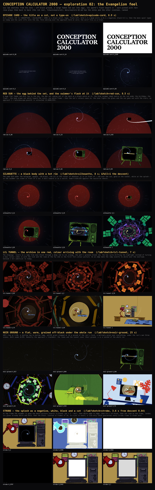

# Exploration 02: the Evangelion feel

Discovery, not a cut. The lead's note: off-black ground, a large faded red sun
(the egg), the sperm's flash toward it — the Evangelion feel. Scouts proposed
twenty-five treatments, scenes and transitions for it through different
lenses (the frame and its ground; the egg and the flight at it; the swimmer's
body; the cut, the hold and the card); three judges scored every one for fit
with the run, novelty and buildability; the top six were built as lab
sketches, each a pure function of its progress, so
`/lab?sketch=<name>&at=0.42` pins any frame. Nothing here touches the run:
`/` is as it was. To watch the six END TO END, in the order they would sit in
the run, **`/eva`** plays them back to back (it is `/v4?chain=explore2`, a
reel with hard cuts between the sketches; `?at=` pins the reel as a whole,
`?gl=1` forces the WebGL 2 backend). Every sketch reuses the run's own
modules — the nest, the kaleidoscope, the swimmer, the sky, the three scenes
themselves — where it can, so what is on the page is what the run would draw.

Two of the six are the note word for word (the red sun, the flash); the other
four are what the note implies: the body that can stand in front of a sun, the
red the tunnel would be, the ground every frame sits on, and the cuts —
the title as a cut, the splosh as one.

## Status, and what is left

The six are lab sketches on `dev`, playable at `/eva`; none of them is in the
run. What each needs to go in is under its own "TO MAKE IT REAL" below; in
short: the card's phase into `Prelude.svelte` with a licensed serif; the sun as
a rig-child quad in `approach.js` and the flash in its `set(p)`; the silhouette
as a body under the hologram in `tsl/swimmer.js`, its rim driven by the
approach and the descent; the LCL ramp on the ring, wall and disc materials
with one colour uniform the lock drives; the noir ground as one constant in
`palette.js` and `noir(u)` in `backdrop.js`, its over-grain a pass of its own
(the run's post pass was taken out); the strobe as frame-counted windows in
`timing.js` and three
camera-child quads in `descent.js`. Not looked at yet: the reel on the WebGPU
lane, portrait, and any of it as a real run rather than a seek (the strobe and
the card were run; the rest are pins). The reel was checked at one pin per beat
on the WebGL lane.

The rooms' objects are now tiled as the wallpaper is and every repeated
object in the fall and the tunnel is instanced (the round after this one);
nothing else from that round of notes is outstanding but these six.

## The six, built

### Episode card: the title as a cut, not a type-on

`/lab?sketch=episode-card` — treatment, works. Frames at `?at=` 0.05, 0.14, 0.2195, 0.5, 0.8, 0.95 (8.9 s).

**Where.** The title card (`scenes/Prelude.svelte`, the `prelude` gate): the 0.6 s of typeDelay and a new 1.9 s in front of the mono spiel, over the approach mounted underneath and held at progress 0. Every cut lands black over black, the one place in the run where a hard cut costs the continuous shot nothing; the spiel, the hold and the lift onto the sky are then exactly as today.

**The idea.** The run opens on its quietest image and Evangelion opens on its loudest. 0–0.6 s black, nothing. 0.6: CUT to CONCEPTION / CALCULATOR / 2000 in a black-weight serif, white, huge, flush-left, the block filling the lower left and the upper right empty, held 1.3 s dead still with no typing and no caret. 1.9: cut to the negative — the same card black on white — for 0.1 s. 2.0: cut to black, held 0.5 s. 2.5: the three mono lines type as they do today (the small typed readout against the huge cut serif is the two-register pair the note asks for), hold, and the card lifts onto the sky coming up, as now. Pure editing — cuts and a hold — with nothing under it to break; and it gives the run a second typeface to spend later (the date, the verdict, the readout).

**As built.** The ground is the approach at p 0 on the run's lens and hand — the run's air, the two star fields, the motes and the swimmer from approach.js, all at nought until the lift. Over the canvas the sketch makes its own overlay (one fixed div at Prelude's z 20 and one style element, both removed by dispose) holding the serif title (Martina Plantijn Black, loaded with FontFace from static/fonts), an optional mono EPISODE:01, and Prelude's spiel with its ghost/live pair so a centred line does not crawl as it types. set(u) turns the time into a phase by a step function (black | card | neg | gap | spiel | lift): the title's visibility is stepped, the negative is a class, the spiel's shown counts are Prelude's own, the caret's blink is off the clock rather than a CSS animation, so a pin is a pin. The one fade is the lift, under which the approach's p runs from 0 for 1.5 s so the last frames are the run's own opening. Three lines, not two: CALCULATOR 2000 on one line at a black serif 12vw is ~2200 px wide at 1280.

**Notes.** WORKS (seeked frames, webgl lane, no console errors; and checked as a RUN: loaded unpinned the DOM goes black → card → neg → black → spiel → lifting → gone, in order, every cycle, the negative caught each time). The serif in the tree reads as a Mincho stand-in; at 12vw the three lines fill the lower left with the upper right empty, exactly the off-centre card the brief describes; the negative is a full white frame with the card in black and it is the strobe; the mono spiel is pixel-for-pixel Prelude's. DOES NOT / caveats: the lab has no Glass.svelte scanlines, so the negative is clean white here and would be scanned in the run (probably better, unverified); the serif is a TRIAL file (`test-…woff2`), fine to look at and not for main without a licence — a free Mincho has to be judged on the card; 15vw runs CONCEPTION off the right edge at 1280, 12 is the ceiling; the 0.1 s negative is a window, not a frame count, and can be dropped whole on a 2 fps warm-up. TO MAKE IT REAL: Prelude.svelte keeps its clock and gains the phase from it, one `<h1>` in the serif with visibility stepped in the tick, a `.neg` class toggled from t and skipped under prefers-reduced-motion; SCENES.calculator gains cardHold 1.3, negHold 0.1, cardGap 0.5; the serif declared in styles/fonts.css and preloaded. The approach under it is untouched; the only cost is ~1.9 s more at the gate.

**Switches.** `?hold=1.3 ?neg=0.1 ?gap=0.5 ?tail=1.5 ?font=serif|mono ?size=12 ?lines=3|2 ?align=left|right ?x=8 ?y=90 ?text=a/b/c ?ep=1 ?spiel=0 ?sperm=0 ?wobble=0`.

### Red sun: the egg behind the set, and the swimmer's flash at it

`/lab?sketch=red-sun` — scene, works. Frames at `?at=` 0.06, 0.25, 0.435, 0.6, 0.82, 0.94 (8.5 s).

**Where.** Approach, the whole flight: the sun comes up with the sky over fadeIn, is held under the birthday at the ask, the 60s set comes out of the dark as a black notch on it from screenIn, the flash at [0.4, 0.46] (the strobe frame at 0.4372), the set's colours ease in over [0.6, 0.85], the nose lights the glass at p* as today, and the sun goes out with the stars over skyOut, so approach 1 = kaleidoscope.pose(0) is untouched. In place of the signal point.

**The idea.** The run is a sperm flying at an egg and today has no egg: the flight is toward a television. The ovum returns as Evangelion's sun: huge, flat, faded, red, low in an off-black sky, with a silhouette on its limb — and the silhouette is the archive's 60s set, which sits between the swimmer and the thing it is really flying at. The blue swimmer on the red is the run's colour walk (blue the one cold thing) made into a composition. The hold at the ask becomes the frame the run is stared at longest: red sun low, black above, the blue body dead centre on the red, the question under it. The flash is a cut, the other half of the Evangelion grammar: the swimmer dashes toward the sun as a white streak, one frame of white, and it is back at its ride as if nothing happened.

**As built.** The approach hosted in the lab on the run's own modules — createNest and createKaleidoscope (the 60s set, the stencil chain, the tunnel and room 0 inside its glass, the switch-on at the glass's centre exactly as approach.js has it), the run's sky, debris and swimmer, LENS, the hand on the camera, the flight at one speed — with three additions. THE SUN: one quad, a child of the rig at 0.9·starDist like the stars (no parallax, leans with the hand), 1.5 frame heights across, centred 0.55 frame heights below the axis so its upper limb cuts the frame a fifth above centre; drawn OVER after the stars and before the set, so the stars are only in the black above the limb and the set is on the red; the ground mixed 0.65 toward a red (#8a1f16) shaded 15% darker toward the limb and 12% toward the top, plus a static ±4/255 hash grain on the pixel grid that also eats the limb. THE SILHOUETTE: the set blacked by a second quad on the bezel's plane — the drawing's own glassCut alpha painted black where the stencil is 0 — easing 1→0 over [0.6, 0.85]. THE FLASH: over the window the swimmer's lead grows ∝ e² by 9 units (it shrinks toward the set on the sun), its z scale is drawn out ×6 and its hologram gain goes from 1.15 to 4 (white), then a full-frame white quad for 0.006 of progress (~2 frames), then the ride. Pure function of p throughout.

**Notes.** WORKS: clean on both lanes (webgpu at 0.25 and 0.435: same picture). The six frames tell the beat: the red developing out of the black low in the frame; the hold with the blue body on the red and its tail curling up into the black above the limb; the streak — a white line from the right edge of the frame into the black notch on the sun; the TV silhouette, legs and all, on the red; the green 60s set with its glass black on the red; the hairline across the glass with the sun half gone behind it. Seam proof, measured: at 1 with `?sperm=0` the sketch diffs against itself with `?sun=0&sil=0&flash=0` at mean 0.0000/255, 0 px changed; at 0.25 / 0.6 / 0.94 the diffs are mean 14.4 / 14.0 / 5.2, so the change is real and confined to the flight. At level 0.55 with a 35% limb darkening the disc read as a shaded ball, a planet; flattened to 15% and lifted to 0.65 it reads as a flat faded disc, which is the picture. WHAT DOES NOT, honestly: (1) the streak is the tail — a dash along the axis is along the line of sight, so from behind it is a pure shrink; what streaks is the tail's helix, off-axis, stretched back toward the lens, and its direction is whatever the roll has that frame, so in motion it is a whip out to one edge of the frame rather than a line into the sun; striking on a still, and a real run at the swimmer's real-time roll will throw it a different way each time (`?streak=2.5&dash=14` is the quiet version); (2) the sun going out over skyOut (0.6 s) is visible where 1100 dots dimming is not — at 0.94 the red is still half there behind the set, the price of the seam being by construction; (3) the white frame is 2 frames, so a pinned reel frame in [0.4372, 0.4432] is white; (4) `?sil=0` is the coloured 60s television on a red sun, a cartoon; the silhouette is the honest version; (5) the `?edge` moon is a plain grey disc, a stand-in; (6) no DOM, the question is not typed under the hold; (7) portrait not shot. TO MAKE IT REAL in approach.js: the sun quad beside `signal`, a rig child, driven off `on`'s two windows in set(p); one uniform on kaleidoscope.js buildScreen's bezel material instead of the overpaint quad; the flash in set(p) on the swimmer's z, z-scale and gain, the strobe a camera-child quad; the signal point goes.

**Switches.** `?sunD=1.5 ?sunX=0 ?sunY=-0.55 ?red=8a1f16 ?level=0.65 ?limbDark=0.15 ?topDark=0.12 ?grain=4 ?limb=0.015 ?sunIn=0,0.1 ?sunOut=0.9,0.985 ?sil=1 ?silOut=0.6,0.85 ?flash=1 ?flashAt=0.4 ?flashLen=0.06 ?dash=9 ?streak=6 ?flare=4 ?strobe=0.006 ?signal=1 ?edge=past|future ?hold=1.5 ?from=0&to=1 ?sperm=0 ?sun=0`.

### Silhouette: a black body with a hot rim

`/lab?sketch=silhouette` — treatment, works. Frames at `?at=` 0.12, 0.25, 0.5, 0.85, 0.91, 1 (8 s); `&fall=1` is the descent on the real nest.

**Where.** The swimmer, the whole run: the approach (against a red sun in the sky, then the black glass of the set), the kaleido (against the rings, the rim gone gold), the descent (against the painted rooms and the last glass, the rim gone white). The seam frame is untouched: p 1 with `?sperm=0` diffs against the switch-on sketch's own p 1 at mean 0.024/255, 529 px of 1,024,000 — the level CLAUDE.md calls the shuffle.

**The idea.** Today the swimmer is an additive wireframe hologram — a drawing of light that vanishes over anything bright, which is why it cannot stand in front of a red sun or a yellow glass. Put a BODY under the drawing: the same GLB, opaque, ink near-black, with a rim of light along its edge in the colour of whatever field it is in front of — red over the sun, gold in the tunnel and over the rooms, white at the splosh — and the holo drawn on it, depth-tested, so the rings are marks on the near side of a body rather than a cage seen through. On the off-black it is a shape defined by a hairline of light; on colour it is a black sperm cut out of the field with a hot edge: Evangelion's figure against the sun. And the sun itself, the note's egg, dead ahead in the sky the card lifts onto. The bolt — the note's flash — as a switch: on the answer the body lights and goes, after-images streaking behind it, and drops back before the contact so the switch-on and the seam are as they are.

**As built.** The whole approach on the switch-on host with two things changed and one added. THE BODY: the swimmer's group deep-cloned, every mesh in a silhouette material — the skin material's fresnel with a gain on the rim, depth written, premultiplied OVER — drawn under the holo, depth-tested and depth-writing so the head hides the tail; the run's holo then depth-tested against it at 0.4 of its opacity so the rings sit on the body rather than whiting the rim out. The rim's colour lerps red → gold over skyOut, its alpha from 1 to 0.85 (a fully black body over the rings is a hole in the picture). THE SUN: one quad on the rig at a fixed distance, a disc 0.72 frame heights across with a faint halo, lum 0.42, 2-pixel grain hashed on the run's clock at 24 a second; up on fadeIn, out with the sky. THE FALL (`?fall=1`): the real nest, the run's own swimmer placed exactly as descent.js places it, plus the body clone with the rim lerping gold → white over the dive, both drawn a hair above the splosh. THE BOLT (`?bolt=16`): lead 5.5 → 16 over [ask, ask+0.06], back over [0.55, 0.75] before the contact; seven more bodies at lead(p − k·0.008) as after-images; the motes' length trebled for the window.

**Notes.** WORKS (webgl lane; all claims from seeks of the lab page): at 0.12 a rim-lit shape on the off-black over the sun's limb; at 0.25 a black sperm across the dull red disc, the head a red-rimmed dot, the near tail curl a black loop with a red edge, the far tail a hairline black spiral out past the limb — the note's image; at 0.5 the set's black notch growing under it on the red; at 0.85 black on the set's black glass; at 1 inside the tunnel, gold-rimmed over the rings. The fall at 0.4: a black curl with a gold rim across the 90s room's pale screen — black on a light field, which the holo could never do. HONEST: (1) at the run's riding size the head is ~25 px and the rim covers most of it, so on the red the head reads as a red ring with a black dot rather than a black disc with a hot edge; the tail is where the silhouette really reads (`?power=4` thins the rim, `?span=0.6` shows the body large); (2) "a black shape going into white" does not exist under the run's timing — the swimmer is gone at 0.975 while the splosh is at 0.12 of the way after, and even held past it the body at the last glass is a hairline curl on the white; a negative frame would need the DOM flash; (3) in the tunnel and over the rooms the body at alpha 0.85 is still a dark hole with a gold edge; (4) the bolt bends the flight's no-slowing rule, which is why it is a switch; the ghosts are a pure function here because the sketch's clock is p, and in the run the roll is real time so the seven poses would have to be kept from the last seven frames; (5) the star seed is the lab's, so the seam diff is against the switch-on sketch, not the run. TO MAKE IT REAL: loadSwimmer({ solid, rim, rimPower }) adds the body traverse under the holo, exposing uRim/uGain/uOpacity; `?sperm=0` must hide both meshes (a body at alpha 0 still writes depth); approach.js drives the rim red → gold and the alpha over skyOut, descent.js gold → white over the dive; the sun a quad on the approach's rig with a config block; the holo depth-tested at ~0.4 while the body is on.

**Switches.** `?from=0&to=1.06 ?stretch=1 ?solid=1 ?tunnelsolid=0.85 ?rim=e5372a ?rim2=f0c45c ?rim3=ffffff ?gain=1.6 ?power=2.5 ?ink=0a0806 ?holo=0.4 ?holodepth=1 ?span=0.28 ?sun=0.72 ?sunc=e5372a ?sunlum=0.42 ?grain=0.14 ?sunx=0&suny=0.04 ?sunin=0,0.1 ?bolt=0 ?ghosts=7 ?lit=1.6 ?ghostroll=0 ?signal=1 ?tunnel=0 ?fall=1 ?decades=… ?gone=0.975 ?sperm=0`.

### LCL tunnel: the archive in one red, colour arriving with the room

`/lab?sketch=lcl-tunnel` — treatment, works. Frames at `?at=` 0.05, 0.3, 0.55, 0.75, 0.84, 1 (7 s).

**Where.** Kaleido, the whole tunnel: monochrome red from the glass through the drift, colour easing in over lock [0.68, 0.92] with the turn and the hue coming to rest, so kaleido 1 / descent 0 is exactly today's frame. On an edge date the red goes to a negative over the overload before the collapse.

**The idea.** Today the rings are the archive's drawings in full colour with the hue cycling — a rainbow down a tunnel, and a rainbow reads as a screensaver. Here the search is MONOCHROME: every drawing's level onto a two-stop ramp, near-black to a deep red (#7a1f14) to LCL orange (#e8802a) at the highlights, on an off-black that is not quite black; the wall's gold grooves a dull blood red; the disc round the first room the same red. The run's hue cycle no longer turns a hue but drifts the highlight stop between the red and the orange, so the tunnel is banded warm and cold and the bands travel. Then the search ends and colour comes in with the lock: the drawings' own colour fades up under the red, the wall and the disc go to gold, and the room at the far end — which never was mono — is the first full-colour picture in the run. A song is found, and the world gets its colour back. On a birthday the archive cannot answer for there is no room and no colour: the red holds, and over the overload the ramp inverts to white on black — the strobe the note wants, without adding a frame — before the set switches off.

**As built.** The run's own kaleido on the-many's host, with nothing of the run's edited: the sketch WRAPS the ring materials' colour nodes, the wall's and the disc's, applying the ramp to what each node returns (its hue turn, level, depth fade and alpha intact) and mixing back to the run's own colour by one uniform uColour = smootherstep(span(u, colourIn)). The drawings are keyed on the mean of r, g, b rather than luminance, because hue() is a rotation about the grey axis, so the mono picture does not breathe with the hue cycle; the wall and the disc are tinted by a per-channel ratio so their grooves, sheen and pulse are untouched; the negative is a grey negative of the level; the ground is a warm off-black (#100806) lerped to the run's as colour comes in; the swimmer stays the run's blue (the brief's black body with a red rim is an additive hologram, so "black" is nothing and the red outline is lost against the red drawings).

**Notes.** WORKS: clean on the webgl lane on every sheet. The frames: through the yellow glass into red televisions with red rooms in their screens; the same, visibly warmer; the poster ring bright orange while everything else stays deep red; the room out of the dark in colour at the end of a red tunnel, the disc's grooves dull red round it; the disc gold, the last rings in their own colour, the room taking the frame; today's frame. SEAM, measured: at 1 with `?sperm=0`, default against `?mono=0` diffs at mean 0.0000/255, 0 of 1,024,000 px — bit-identical; at 0.05 and 0.75 mean 28 and 14/255. EDGE: red, flatter and brighter over the overload, the drawings inverted to pink-white on black, white with the CRT line across, then the strip and the dot; it lands on black from white, which is the cut the note wants. DOES NOT: (1) the tunnel is DARK — the ring drawings are mostly line art, whose level maps to the near-black stop; `?tint=blood` is more saturated, `?tint=dusk` the violet in which even a red swimmer reads — a taste decision for the lead; (2) the drift is subtle between frames and only moves in motion; (3) only seeks are evidence — a run without `?at` was smoked but SwiftShader never reached the lock in wall time; the sketch has no inherited state, so they agree by construction; (4) the red swimmer variant is honestly lost in the red tunnel. TO MAKE IT REAL: kaleidoscope.js's ring material gets the ramp on its own node (colour-stop uniforms, uColour, uNeg), keyed on the mean; the wall and nest.js's disc multiply their gold through one shared uniform; kal.set(u) sets uColour from the lock and, in the breakdown, uColour 0 and uNeg = o²; approach.js set(p) must also set uColour 0 — the set's glass shows the tunnel from 0.35 on, so the approach's baseline sheet changes and must be reshot. None of it touches the camera.

**Switches.** `?tint=lcl|blood|dusk ?colourIn=0.68,0.92 ?drift=1 ?negative=1 ?edge=past|future ?ground=100806 ?wall=1 ?disc=1 ?swimmer=blue|red ?mono=0 ?sperm=0`.

### Noir ground: a flat, warm, grained off-black under the run

`/lab?sketch=noir-ground` — treatment, partly. Frames at `?at=` 0.017, 0.084, 0.266, 0.42, 0.554, 0.78 of the whole run (25 s: approach, kaleido and descent end to end).

**Where.** The ground of all three 3D scenes, from the title card at approach 0 to the black at the end of the fall.

**The idea.** Evangelion's frames are never quite black and never blue: a warm, grainy near-black with flat fields on it. The run's ground is a blue channel — a halo and a core that lift toward the middle of the frame — so the sky, the set and the rooms sit in a soft blue pool. The palette file already says the fly-in's air is an off-black lifted off the void and WARM (AIR, the page's own --bg), and the three scenes drifted to a blue. So: one flat, warm, off-black field in AIR's hue at a set luminance, no channel, at most a shallow top-to-bottom ramp the way a night sky sits over a horizon; film grain on it, hashed per device pixel and stepped at 24 a second of the RUN'S clock, so a pinned frame has the same grain every load and a run's grain crawls like stock; and grain over everything, not just the ground. The blue things — stars, motes, the swimmer's hologram — stay blue, the palette's own rule.

**As built.** The host IS the run: the run's own createApproach, createKaleido and createDescent on one nest and one kaleidoscope, entered in run order, with only `scene.backgroundNode` swapped on each. The ground is AIR's hue scaled to a luminance of 0.06 (#110f0c), a 25% top-to-bottom ramp, a signed ±4/255 grain from three/tsl's integer hash on the device pixel hashed again with the frame seed = floor(runSeconds(scene, p)·24), so a seek and a run land on the same seed and approach 1 / kaleido 0 share one seed, kaleido 1 / descent 0 another. The full-frame grain is a camera-child quad drawn last, a MULTIPLY (1 − k·hash) rather than an add, because an add of near-black size is under a step on a lit room while a multiply grains what is lit in proportion, as stock does. Measured at 1280×800: the noir corner is (12.4, 11.2, 8.7), warm, the top band 22% darker than the bottom; the run's deep ground has a (16, 20, 34) pool at the centre. Both seams with `?sperm=0` diff to mean 0/255, 0 pixels changed; the webgpu lane gives the same numbers to the pixel.

**Notes.** WORKS: the approach's three beats are the picture the note asks for — the card's black, the swimmer's blue hologram and the set's yellow glass all on a flat warm off-black with fine grain in it instead of a blue pool; nothing but the ground moved; both seams are bit-identical because the grain seed is the run's clock. DOES NOT, said plainly: (1) the idea's fall beat is wrong for this build — the ground is never seen from the record label on: the rooms' back walls are drawn past their frames with the wallpaper looped, and the last monitor's glass is painted, so from u 0.55 to the end the only thing this treatment changes is the full-frame grain on the rooms; (2) in the tunnel the ground barely shows either — the wall of grooves and the CRT mask cover it; the ground is really the approach's, and the seam into the tunnel; (3) the over-grain is one-sided (a unorm8 target clamps at 1, so a multiply cannot brighten): at 8% it dims what is lit by 4% on average, an exposure tick invisible without an A/B but a real number; a mean-preserving grain would need a post pass of its own; (4) the stars and motes are untouched and read colder on the warm black by contrast alone; (5) at sheet scale the ground grain is invisible; it reads at full size. WHAT THE CALIBRATION TAUGHT: the run has ColorManagement OFF, so a colour is used as set and a shader unit is a display unit; the first cut converted the grain through the sRGB slope and came out 2.3× too weak. TO MAKE IT REAL: one GROUND constant in config/palette.js read by the three scenes instead of the literal 0x090b14 in each; `noir(u)` in three/tsl/backdrop.js next to `deep` with ramp, grain, seed and channel uniforms, the seed from runSeconds() as the hand on the camera already is; the over-grain into the signal pass rather than a quad.

**Switches.** `?scene=run|approach|kaleido|descent ?ground=noir|flat|deep ?lift=0.06 ?warm=1 ?ramp=0.25 ?grain=4 ?over=8 ?fps=24 ?channel=0 ?edge=past|future ?sperm=0`.

### Strobe: the splosh as a negative, white, black and a cut

`/lab?sketch=strobe` — transition, works. Frames at `?at=` 0.2, 0.3446, 0.3563, 0.3797, 0.5432, 0.7 (3.6 s, from descent 0.84).

**Where.** Descent, the last crossing and the landing: the dive, gone, the splosh, the flash, and the first second or so of the room's hold before the drain — replacing the spreading blot and the DOM flash. Nothing before the strike frame changes, so descent 0 and the seam with the kaleido are untouched by construction.

**The idea.** Today the swimmer goes into the last room's glass and the glass goes white under it — a blot spreading from the point of contact with a DOM flash fading over the frame: soft, and it never stops. Evangelion's impact is the one you never see: a frame of negative, a frame or two of white, a hard cut to black, a hold with nothing in it, and when the picture comes back the world is different and already going on. A conception is the one event in the story that happens between two frames, so it is cut like one: at the frame the swimmer is gone the whole picture inverts — the off-black ground a warm white, the room's colours turned, the swimmer an orange smear on the glass, the last thing you see of it — then white edge to edge, then black, 0.6 s of it, the run's first silence; then the room on one frame, landed, level, the hand off, its glass already white — nothing spreads, the state has changed — held, and then the white drains as today.

**As built.** The end of the descent as the run has it — the real nest, LENS, the hand on the camera coming off over the settle, the swimmer riding and diving as descent.js has it — from p 0.84 to the landing and on into a landed tail on the sketch's own clock. Three full-frame quads, children of the camera in a group of their own (so the swimmer's additive pass cannot draw after them), depth and stencil off. The NEGATIVE is a blend, not a shader or a pass: CustomBlending with blendSrc OneMinusDstColor, blendDst Zero, src white, so out = 1 − dst for whatever the frame holds, the stencil chain untouched — and the alpha function set apart, which is load-bearing: left to follow the colour's, the frame's alpha goes to nil and the compositor shows the page's black through it, on both lanes. The WHITE is a flat quad; the BLACK a quad with a uniform alpha for the fade. FRAMES, not seconds: f = floor(s·fps), the strike is the frame `gone` falls in, neg [0, 1), white [1, 3), black [3, 17) (0.6 s), the room back on frame 46, so a pin is exact and two loads of the same pin draw the same beat. A live-only latch in update() stops the clock at a strobe frame that has not been drawn yet, so a slow machine never skips the negative; pins never go through it. Reduced motion: no negative, no white, the cut to black kept, the room back through a 0.3 s fade.

**Notes.** WORKS: the six frames tell the beat in order, no console errors on either lane, and the key beats are pixel-for-pixel the same picture on the WebGL and WebGPU lanes. The negative is a true negative of the drawn frame — the 90s yellow wall gone blue, the black glass white, the red lamp cyan, the ink white — with the swimmer a small orange spiral on the white glass. A LIVE run drew every beat in order with all three strobe frames rendered and the latch firing once. DOES NOT, or not here: (1) the DOM raster that comes off over `landing` is not in the lab, so the white and the negative are shot without scanlines — under Eva rules the strobe is on a TV and should keep them, which the run's Glass would, unchanged; (2) the readout is not in the lab: in the run it must be up on the return frame; (3) the black adds ~0.48 s past the descent's 9 s and the held white 0.4 s before the drain — about 0.9 s before the readout compared with today, and the lead may find the landing slow (`?black` and `?hold`); (4) the swimmer is small at the strike, so the orange smear is a detail at contact-sheet size; `?spread=0.3` keeps a short spread under the strobe; (5) at a real 60 Hz a one-frame negative is ~42 ms; the latch guarantees it is drawn at least once at the cost of a few ms of lag, and that latch is the one impure thing here. TO MAKE IT REAL: three windows in timing.js under descent counted in frames (strike = gone, neg, white, black) plus hold; descent.js set() gets the three quads in its own scene under the camera, steps the swimmer's opacity off at the first white/black frame, replaces the splosh's smootherstep with the stepped setSplosh on the return frame, and retires blaze/FLASH_*; the black's overrun and the held white run in hold(dt); Room.svelte's in:fade is 0 on this path. Nothing about the camera, nest.pose or the way home changes.

**Switches.** `?from=0.84 ?fps=24 ?order=neg,white,black ?neg=1 ?white=2 ?black=0.6 ?hold=0.4 ?spread=0 ?fade=0 ?reduced=1 ?frame=k ?decades=… ?wobble=0 ?sperm=0`.

## The other 19, ranked

Scored out of 90 by the three judges (fit, novelty, buildable, each out of 10, summed). Not built this round; several are the built six from another angle (the sun held under the birthday, the bolt, the strike, the dash), and the rest are cards and holds — the date stamped, decade intertitles, a warning banner for the questions, the verdict as a card after the cross.

- **The sun, held** (scene, 48) — Approach: the sun comes up over [0.16, 0.22], is the frame the birthday is asked on at ask 0.25 (the hold), and collapses to the signal point over [0.25, 0.32] — the signal's own window — so the set comes out of the dark at screenIn [0.25, 0.35] against black exactly as today, and nothing after 0.32 changes. 0.16: the sky is up, the swimmer at its ride from behind, dead centre, un-turned.

- **The hole is the sun: the way home ends in the egg** (transition, 48) — The loop home: descent.stepReturn q [0.72, 0.97] (the swallow, where the spindle hole opens at the lens and takes the frame) into the next flight's approach [0, 0.14] (fadeIn and the lip, on a run that came home through the record - nest.viaRecord). q 0.4: the readout's glass is vinyl, gold zeta grooves turning, the room going to black round it.

- **Warning, then the verdict card** (treatment, 47) — Kaleido on an edge birthday only: overload [0.5, 0.78], collapse [0.78, 0.88], pinch [0.88, 0.93], black to 1 — then the error scene (components/error/ErrorScreen.svelte) that director.advance('kaleido') hands to. 0.5: the tunnel starts to overload as today.

- **Red Sun Hold — the birthday asked against the egg** (scene, 47) — Approach, from the first frame (under the title card, fadeIn [0,0.1]) through swimmerIn [0.03,0.16] to the ask hold at 0.25, staying up behind the set after the answer and going out with the sky over skyOut [0.9,0.985]. p 0–0.1, under the card: off-black (the deep backdrop, 0x090b14, which is already not-quite-black) with a faint red warmth low-right, no disc yet.

- **The Cross — the breakdown ends in a cross of light and a hard cut to a title card** (transition, 47) — Kaleido on an edge date (?edge=past|future): the pinch [0.88,0.93] and the black after it [0.93,1], then the hand-over to the `error` scene. 0.78–0.88 collapse as today: the covers close to the slit with the rings whirling in it.

- **The answer, stamped** (transition, 46) — Approach: the birthday's hold at ask 0.25 and the 1.0 s after the popup closes, over the signal window [0.25, 0.32]; and again at descent p 0 (the spice hold over the record label) and the 0.8 s after it. The popup asks as now (a switch strips the veil and the box so the question is bare mono type on the 3D, the selects underlined).

- **The sun at the end of the tunnel** (scene, 46) — Kaleido, the tunnel's dark eye from u 0 (through the glass) to the lock [0.68, 0.92]: a small red disc dead ahead that the rings turn round; it swells over the lock as the search ends and the first room comes out of the dark IN it, as the label on the sun; covered by the room's wall before `out` ends (0.985) so kaleido 1 = nest.pose(0) is untouched. u 0: the seam frame - the glass filling the height, the tunnel inside - with, at the exact centre of the tunnel's eye, a red dot 0.12 frame heights across: flat, faded, grainy, unmoving while the rings turn and cycle round it, and the blue swimmer dead centre in front of it (the sperm on the egg, tiny, the whole run in one frame).

- **The red sun: the egg, low in the sky** (scene, 46) — Approach, in place of the signal point (signal [0.25,0.32], signalOut [0.55,0.68]): the sun comes up over [0.25,0.38] as the birthday popup closes, holds the whole flight, and goes out with the stars over skyOut [0.9,0.985], so approach 1 / kaleido 0 is untouched. A huge flat red disc, low and off-centre — its centre at (−0.28, −0.32) of the frame's half-height, its radius 0.55 of the frame height, so it is cut by the bottom edge — a child of the rig at starDist like the stars, so it never parallaxes and only leans with the hand on the camera.

- **Dusk rooms: silhouette furniture, a violet wall, the monitor the only light** (treatment, 46) — Descent, every room from the seam (ζ 0) to the landing: the grade eases off over landing [0.82,1] so the answer's room is drawn as it is for the readout and the way home. Each room is six flat drawings: bg, poster, clock, screen behind the glass, desk and bed in front.

- **The Dash — the swimmer's flash to the glass as one white frame** (transition, 46) — Approach, on the answer: the frame after the birthday gate closes (p 0.25) through the switch-on (p* ≈ 0.91) to the seam at 1. Frame A (p 0.25, the hold): the swimmer ahead, rolling, the question under it.

- **The strobe: a frame of white and a negative at the touch** (transition, 44) — Approach, at p* (~0.91), the instant the nose is on the glass plane, inside the switch-on's dot window: white for [p*, p* + 0.006], the negative for [p* + 0.006, p* + 0.018], then the dot flares and the switch-on runs to the seam as today. Frame N: the set dead ahead, dark glass, the swimmer's nose touching it.

- **The card and the cut: the date, then the sun** (treatment, 44) — Three hard cuts, DOM over the 3D, each a window of a scene's progress published as a store the way blaze and landing are: (1) the birthday, approach [0.25, 0.36], the moment the popup closes; (2) the verdict, replacing ErrorScreen's gif on an edge date after the pinch to black; (3) the song, the readout's first 0.8 s before resultIn. (1) The popup closes and the frame CUTS to black - no veil fade - and the answer stands on it, huge, in the site's black serif (static/fonts/test-martina-plantijn-black.woff2, the nearest thing it has to Matisse EB): 'WEEK 26' on one line, '1986' under it at half the size, white, 18vh cap height, set off-centre low-left, ragged.

- **NERV red: the questions as a warning banner** (treatment, 44) — The two holds — the birthday at approach ask 0.25 and the spice on the descent's first frame — where Prompt.svelte's veil (rgba(10,10,12,0.82)) sits over the frame today; and the raster in Glass.svelte the whole run. When the gate opens the frame does not dim to a grey veil: the ground drops to pure off-black (backdrop uFade → 0, stars and motes held), the swimmer keeps rolling, rim-lit red (idea 3), and a RED BAND cuts across the frame — full width, one seventh of the frame high, at the upper third, a flat #c8281c on black, hard edges, no fade in: it is there on one frame and gone on one frame — with the question in white type inside it, left-aligned, off-centre, the caret blinking red.

- **Decade intertitles** (transition, 42) — Descent: the glass crossings ζ = 1 … 4 of the six rooms (nest.zetaOf(p)), each as a step in ζ, not p — never ζ 0 (the seam with the kaleido, nest.pose(0)) and never the last crossing (the splosh). The lens reaches glass k: the frame the bezel leaves the edge of the picture the frame goes BLACK for 0.03 ζ (a full-frame black over the fall, which carries on unseen), then a card for 0.12 ζ: black, the room's decade in the serif, '1970', white, flush right, low, ~16vh; a small mono '3 / 6' top left.

- **Cards on the beat — the date, the week found, the decade, as held frames** (treatment, 42) — Three cuts: (a) approach [0.252, 0.31], the first frames after the birthday gate closes; (b) kaleido [0.90, 0.985], the last of the lock as the hue lands on true colour, out before the seam; (c) descent [0.985, 1] plus the first 0.5 s of the room's hold, over the room landing level, out before the readout's resultIn delay (0.25 s). (a) The still after the answer: the swimmer ahead, rolling, and over it — cut in on one frame — the date, white, huge, heavy Mincho, low-left, as digits '1987.03.14', a 1 px red rule under it and a small line above in the same face: 'SEARCHING THE ARCHIVE'.

- **Letterbox holds — the held frame that feels held, and the snap that is the cut** (treatment, 42) — Every hold in the run: the ask (approach 0.25), the spice (descent 0 — which is the kaleido/descent seam, so the kaleido closes the bars over [0.97,1] and the descent opens them), and the landed room (descent 1 into the hold, open again on 'go again'); and the title card (approach 0 under Prelude), where the bars are already in and lift with the card. Eight frames before a hold, the CRT mask's two black covers close from the top and bottom of the frame to a 2.39:1 letterbox (on a 16:10 frame, 16.5% of the height each); inside the bars the picture drops a quarter (a dark veil at 0.25) and 2% grain comes up.

- **Strobe, then three cards** (transition, 41) — Descent: the dive [0.88, 0.972], the splosh [0.962, 1.0] and the blaze [0.966, 1.0]; then the room (scenes/Room.svelte), whose readout today fades in 250 ms after the scene ends and whose white drains over 0.9 s. 0.962: the nose meets the last glass; the glass goes white (the splosh, as today).

- **The bolt: silhouette, then the streak at the sun** (scene, 40) — Approach, from swimmerIn [0.03, 0.16] through the ask hold at 0.25 (the silhouette) and then [0.25, 0.31] (the bolt: lead 5.5 -> 16), holding far ahead against the sun until signalOut [0.55, 0.68], dropping back to lead 5.5 by 0.75 - before p* (~0.91), so the switch-on and the seam are untouched. 0.03-0.25: the swimmer is not the blue hologram.

- **The Strike — the splosh as a white frame, a negative, black, then the room** (transition, 32) — Descent, the last beat and the landing: dive [0.88,0.972], gone 0.975, splosh [0.962,1], blaze [0.966,1], and the first 0.7 s of the room's hold (before the drain). p 0.88–0.975: the dive as today — the swimmer leaves the axis for the glass, the last room level, the hand off.

## Reproducing the page

    npm run dev
    SKETCH=<name> ATS=<a,b,c,d,e,f> OUT=<dir> node <scratchpad>/explore/labshots.mjs

for each sketch (the helper pins `/lab?sketch=<name>&at=` on the WebGL lane and composes a sheet); the page was composed in the scratchpad from those frames. The ideas, the judges' scores and the builders' notes came out of one workflow run, six builders in six worktrees, each on the run's own modules; the sketches are the deliverable, and `/eva` is where they play.
