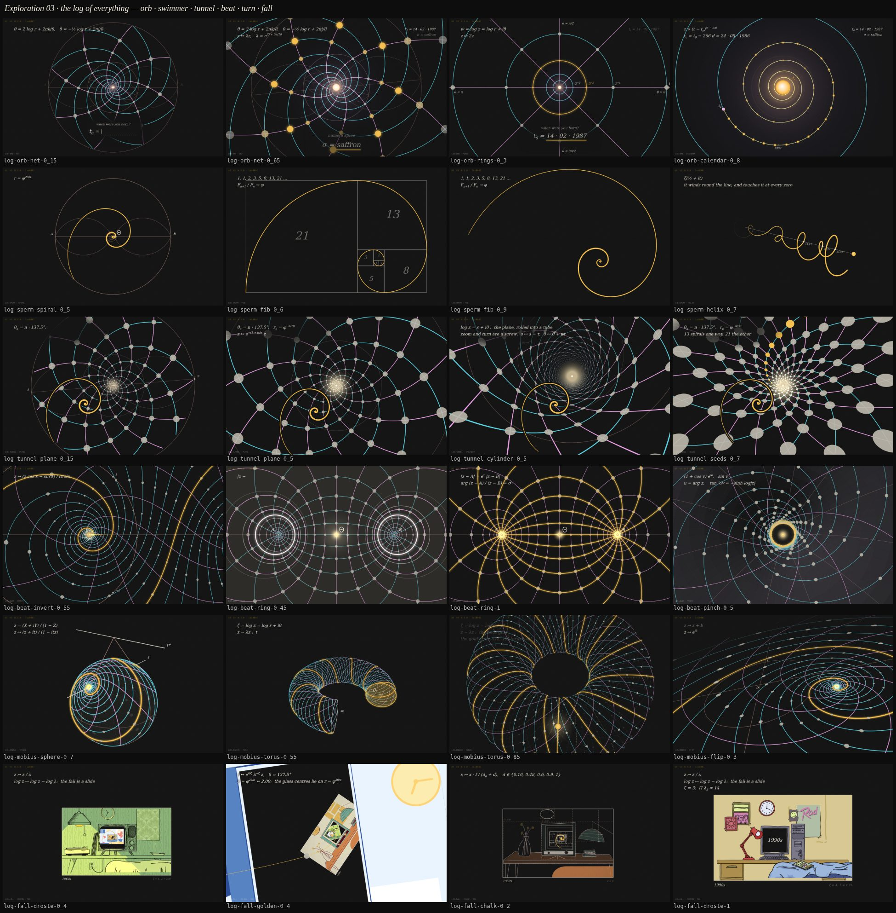

# Exploration 03: the log of everything

Discovery, not a cut — the angle for the next rebuild. The lead's note, after
two maths explorations (_Pencils of circles_, _Theta harmonics_), the _Atlas of
the Logarithm_ and two plates from it (the cyan and pink loxodrome net; the
golden spiral in its circle, which reads at once as a sperm): build the
swimmer out of a golden spiral, no model; swim it down the tunnel the golden
angle makes; hit a beat at the centre; a projective, Möbius zoom out and round
in 3D; and a last fall into the parallax tunnel of rooms — clean, bold,
coloured line on a blackboard, the space-time geometry of the site rather
than the biology of the old runs. Try variants of each before any of it is a
run. And the heart of the PM's notes alongside: far fewer beats from the
questions to the room, no swimmer while the questions are asked, a glowing orb
the questions fly toward, and the room's parallax at the end.

So: six beats, each a lab sketch in three or four variants — nineteen in all —
on one shared blackboard. **`/log`** is the index: every variant, a sentence
each, a link into the lab. **`/v4?chain=log`** is the reel: one variant of
each, end to end, in the order of the run, hard cuts between them
(`?pick=rings,,cylinder` swaps a beat's variant, in order, a blank keeping
the chain's). Every sketch is a pure function of its progress, so
`/lab?sketch=log-tunnel&v=seeds&at=0.5` pins a frame exactly. Nothing here
touches the runs: `/` is v3 as it was and `/v2` is v2; the one change to them
is the full stop the PM asked for at the end of the title card's sentence.

## The one idea

The complex logarithm turns scaling into sliding. `w = log z` unrolls the
punctured plane into a strip, and the strip rolls up into a cylinder; so a
**zoom into a point is a flight down a tunnel**, a logarithmic spiral is a
straight line on that tunnel's wall (a helix), and a zoom-and-turn — the
loxodromic Möbius flow — is a slide along it. The golden spiral is the
logarithmic spiral that grows by φ every quarter turn, so turning it IS
scaling it: spun steadily it pours itself out of its own head, which is a tail
beating, and swum into its own pole it never changes shape. The golden angle,
137.5°, laid along the cylinder is a lattice — the seed head is its own zoom,
so the tunnel never runs out. Close the cylinder's two ends and it is a sphere
(0 and ∞, the stereographic picture, where the nets are the two pencils of
circles); glue them by a zoom and it is a torus, and a loop round that torus
is a Droste fall — the rooms through rooms the site already has. Every beat
below is one face of that one map, which is what grounds the whole run in
space-time rather than in a body.

## The look: a blackboard

`src/lib/lab/log/` — one 2D canvas over the page (`board.js`), repainted
whole by whichever sketch is on. A dark board (#151515) with a faint chalk
dust; chalk for type and nodes (grey discs, as on the plates); three bold
colours, one job each — gold for the golden spiral and the swimmer, cyan and
pink for the two families of a net — and a rose for construction lines. Maths
is written on like a lecture (`note()`, `math()` with super- and subscripts,
type-on by progress): a line or two of what the picture is, `r = φ^{2θ/π}`,
`z ↦ −1/z`, the coordinates of the answers as `t₀ = 14 · 02 · 1987`. The 3D
(the sphere, the torus, the cylinder, the funnel) is projected by hand
(`camera3`, `stroke3`, hidden lines dashed and faint), the way the Atlas draws
its plates. It is 2D on purpose: the look is lines, discs and type, and a 2D
canvas draws those crisply on every device and costs a fraction of a WebGPU
frame. `plate.js` is the construction behind the lead's plate; `sperm.js` is
the swimmer.

## The six beats

### 1 · The orb — `log-orb` (10 s)

The questions, and no swimmer. The board, and at its centre a glowing orb — a
bright disc, a warm bloom, a cold haze, breathing, with log-spaced rings
breathing out of it. Each question is written in chalk below it, its answer
typed into the blank as a coordinate, and on entry the view takes ONE
logarithmic step into the orb: the geometry slides out past the edges, the
prompt rides out with it, the orb comes closer. What was entered stays in the
top right as the board's givens. Steps at u ≈ 0.32 and 0.66, then a hold close
on the orb — the frame the swimmer appears in.

- **`net`** (the reel's) — the orb is the pole of the lead's loxodrome net:
  eight cyan spirals coiling round it, eight pink running out of it, crossing
  at right angles at grey nodes, over the faint rose plate. The net maps to
  itself under `z ↦ λz`, `λ = e^{(3+i)π/10}` (×2.57, 18°), so each step is
  exactly that: the same picture, closer and turned; a ring of gold runs into
  the orb along each. Closest to the lead's image and the strongest. Best at
  0.15, 0.3, 0.65, 1. The top-left caption is true but dense.
- **`rings`** — the complex log's own picture: rings `r = 2^{−k}` and rays
  every π/4, labelled; each answer slides in by exactly one ring (the ring that
  takes the last one's place goes gold, the labels count on). The most
  legible "a zoom is a slide"; more diagram than mystery. Best at 0.15–0.45.
- **`calendar`** — time as a log spiral round the orb, a turn for every
  factor e of age, the years along it. The birthday is marked as `t₀`; on the
  second answer 38 gold beads, a week apiece, count the 266 days back to the
  pole, and the orb turns gold: it IS the moment of conception
  (`t_c = t₀ − 266 d`). The most honest reveal, the busiest end. A log spiral
  cannot give a turn per calendar year from 1960 on one screen, so its turns
  are factors of age.

### 2 · The swimmer — `log-sperm` (10 s)

The sperm as a stretch of the golden spiral `r = φ^{2θ/π}`: the tight coil at
the pole its head, the arc unwinding from it the tail, a wave running down the
tail as an angular nudge, so it stays on the spiral's family.

- **`spiral`** — the lead's plate written on (circle, axis, the lenses through
  each end, Θ), the spiral drawn out of the pole, the beat starting down the
  tail; then the whole swimmer swims INTO its own pole, turned and shrunk by
  the same law, so its shape never changes as it goes.
- **`fib`** (the reel's) — the blackboard construction: the Fibonacci squares
  1 to 21 laid out and numbered, a gold quarter-circle in each, the squares
  rubbed out, and the true golden spiral through them comes alive as the
  swimmer. The most "lecture" of all of them.
- **`trail`** — the head a point swimming in along the spiral toward the orb,
  the lens zooming with it, the plates nested a turn apart (φ⁴) streaming past.
  Reads as a comet more than a sperm.
- **`helix`** — the tail as ζ(½ + it) itself, wound round the critical line in
  3D, the head at the front and the zeros labelled as they stream past. The
  ζ grooves of v3, as the swimmer.

### 3 · The tunnel — `log-tunnel` (10 s)

Down the tunnel the golden angle makes: log-phyllotaxis, seed n at n · 137.5°
and radius `e^{−cn}`, which on the log cylinder is a lattice, so the flight
into its centre never runs out and the swimmer is held one size the whole way.
The flight only gathers speed (0.22 to 1.6 e-folds a second); at the end the
swimmer outswims the lens into the centre and the light there fills the frame.

- **`plane`** (the reel's) — the lead's loxodrome plate as a tunnel, head on:
  the 8-spirals cyan, the 13-spirals pink (at `c = log φ / 18` they cross at
  right angles), grey seeds growing outward, faint rose rings. It OPENS on the
  plate with the swimmer — the lead's two images, one after the other — and
  the net is written out of the centre; then the loxodromic flow
  `z ↦ e^{−(1+iκ)τ} z` along the 21-spiral streams everything out and round.
  The strongest. Best at 0.15, 0.5, 0.85.
- **`cylinder`** — the same lattice from INSIDE the log cylinder, in
  perspective: the spirals are helices, the rings labelled ribs, the seeds
  foreshortened discs; the zoom-and-turn is a screw. A strong 3D tunnel at
  0.5–0.7; the far end is a dense mesh until the glow takes it.
- **`seeds`** — the sunflower as a funnel: denser seeds on a cone, one
  13-spiral of them gold, the 13 and 21 parastichies between; the lens flies at
  the apex and the funnel keeps pouring seeds. Reads more as a tilted seed head
  than a deep funnel; near seeds grow into big flat ovals at the edge.

### 4 · The beat — `log-beat` (6 s)

The moment, as geometry: the swimmer reaches the pole at u = 0.4 — a wash of
light, a shock off the point — and one transformation follows that leaves the
board ready to turn.

- **`invert`** (the reel's) — on the hit the Riemann sphere turns half a turn,
  `z ↦ (z cos s − sin s)/(z sin s + cos s)`: the point the swimmer hit runs out
  to ∞, ∞ comes in to be the new lit centre, and the net goes through a
  two-pole loxodromic net to land on itself (`z ↦ −1/z`, `0 ↔ ∞`), the
  swimmer's arm pouring gold out of the centre. The mid-flip frames (0.55) are
  the most striking of the round; the end looks like the start but for the
  gold.
- **`ring`** — the plate's bipolar net (circles through A and B, Apollonian
  circles round them); the swimmer is poured into its pole, Θ is stamped
  there, the shock runs the hyperbolic flow out to A and B, and the circles
  through them light gold in turn — the end is a gold dipole field, the
  boldest frame of the round. The approach reads as a drain more than an
  arrival.
- **`pinch`** — the log cylinder on a horn torus, where 0 and ∞ meet at the
  pinch; the swimmer swims a golden loxodrome down into it and the torus
  breathes once, the pinch opening into a gold-rimmed hole and shutting. The
  heaviest to draw (a ray-marched hidden-line test); the pinch is behind the
  horn's own lip from any tilt, so its light is drawn on top.

### 5 · The turn — `log-mobius` (10 s)

Out of the flat board into 3D, the lens never cutting: each variant opens on
the beat's end (the same net, the gold arm, the lit centre) and pulls back to
find what the board was on, and all three end on the same shot — the lens
square to the surface over a growing gold disc, the way into the rooms. Lines
behind a surface are faint and dashed, as the Atlas draws them; a small
software depth buffer decides which, for any surface the net lies on.

- **`sphere`** (the reel's) — the board curls up behind itself into the
  Riemann sphere (`z = (X + iY)/(1 − Z)`) while the lens pulls back and climbs
  round, the unit circle landing on the equator and the net streaming pole to
  pole; then a boost `z ↦ (z + it)/(1 − itz)` slides both poles toward +i, the
  net becomes a two-pole spiral, ℓ (the line through the poles) appears and ℓ\*
  flies in from infinity with the two tangents from the poles drawn up to it.
  The lens swings over the top and dives at ∞. Best at 0.5, 0.7 (ℓ, ℓ\* and
  the tent), 0.85. The curl is the fastest moment and the orbit after it slow,
  so "only gathers speed" holds loosely.
- **`torus`** — the board folds into a funnel, then into the tube a zoom into 0
  flies down, the lit pole a gold mouth at its far end; the lens backs out,
  the tube bends round and its two ends glue (`z ∼ λz`) in a flash, and the
  beat's gold arm closes into a (2, 13) torus knot. The lens dives at the top
  of the gold seam. The Droste loop of the rooms, drawn: the strongest frames
  of the turn (0.55, the ends about to meet; 0.85). Thirteen windings read as
  gold spokes more than as a knot; the camera inside the folding funnel at
  0.25 is busy for a moment.
- **`flip`** — the lecture: the board tilts into perspective over fixed axes
  (0, 1, i) and the three maps act on the net one after another, each written
  up as it happens — `z ↦ z + b`, `z ↦ e^{iθ}z`, `z ↦ λz` — the lit pole carried
  by each; then `z ↦ 1/z`, the board curls into the sphere and turns half over,
  0 and ∞ swapping, and `(az + b)/(cz + d)` is written as the lens dives.
  Five lines of notes, on purpose. Best at 0.3, 0.4, 0.85.

### 6 · The fall — `log-fall` (10 s)

The room as a plate on the board: the site's golden-rectangle frame outlined
in chalk and captioned, the monitor's glass cut out of the drawing so it opens
back onto the board, where the next plate hangs. The lens falls plate, room,
glass, board, plate, gathering speed, and eases to land on the decade's room
(`?decade=50s|60s|90s|10s`), which then sways on its depths — the back wall
most, the bed least — inside its frame: the parallax the PM likes. It is a
real perspective camera on the room's real depths, drawn in 2D (every layer a
plane facing the lens, one similarity each), and from the landing lens the
room is exactly the site's composition. The swimmer rides ahead in every glass
and dives into the last one in a glint; the decade is then chalked on the
glass, where the site writes the answer.

- **`droste`** (the reel's) — the plain nest, glass centres on one axis, each
  crossing the same zoom; a slow sway all the way, so the depths slide during
  the fall too. The plate-and-board rhythm and the landing work; the crossings
  at peak speed (u ≈ 0.5) are fast.
- **`golden`** — each room turned by the golden angle and scaled by `φ^{2θ/π}`,
  so the glass centres lie on a golden spiral, drawn in gold, and the fall is
  one loxodromic flow that untwists to land level. A trippy staircase of
  rooms; the rooms are often sideways and the spiral reads as a tail.
- **`chalk`** — every room first a chalk drawing (the artwork's own ink lines
  redrawn in chalk, each layer's rectangle dashed in with its depth), coloured
  in as the lens arrives, bed first, wall last: the blackboard turning into the
  room. Thin when the plates are small.

## A cut in three beats

The reel plays all six back to back to look at; the run would not. What the
round suggests, for the PM's "one, two, max three":

1. **The questions** — the orb (`net`): two steps in, no swimmer.
2. **The swim** — the swimmer drawn on the board out of the orb's light (the
   plate, or the Fibonacci squares), and straight down the tunnel (`plane`)
   to the centre. One shot: the tunnel already opens on the plate with the
   swimmer in it.
3. **The turn** — the beat and the zoom out as one move: the sphere turns
   over at the hit (`invert`) and the lens pulls out to find the net on a
   sphere, coming round to look down at the point the fall begins at.
4. **The fall** — glass in glass to the room, and its parallax.

Three transitions between the questions and the room, each one thing.

## What it would take

- **The board is a 2D canvas**, which the run is not: the run would mount it
  over (or instead of) the Stage. Everything drawn here is lines, discs, type
  and the room's PNGs, so the WebGPU renderer is not needed for any of it —
  the runs' 3D, materials and stencils would go, which is the "almost a full
  rebuild" the lead asked for.
- **The questions** are drawn on the board here, to show where they sit; in the
  run they would be the popups (`components/Prompt.svelte`), placed under the
  orb, and each answer's coordinate written on the board when it is in.
- **The joins** are not made: each sketch starts from its own first frame.
  The tunnel ends in light and the beat starts dark; the beat's end and the
  turn's start, and the turn's end and the fall's start, were written to meet
  but are not pixel-matched.
- **The answer**: the fall lands in the decade passed as `?decade=`; the song,
  the readout and a birthday the archive cannot answer for are not looked at.

- **The kit** grew in each sketch rather than in `board.js` this round, and
  five things want lifting into it: `stroke3` clipped at the lens (a line
  passing behind it draws spikes) and the Möbius sketch's depth buffer for
  hidden lines on any surface; a backing for `note()` and `math()` over busy
  nets and over the rooms; a stroke with width and alpha per point; an outline
  for the swimmer; and the fall's "image on a plane" similarity.

Checked: every variant at seven pins (0 to 1) and the reel at twelve, with no
page errors; the fall's room crisp at a pixel ratio of 2. Not looked at yet:
portrait; frame rate running live (every frame here is a pin — `pinch`, at
about 10k ray-marched points a frame, the Möbius sketches, at about 45 ms a
frame headless, and the fall's 1.7 s of image loading are the ones to watch);
the reel on a phone.

## The PM's notes, answered

| note                                         | here                                                                |
| -------------------------------------------- | ------------------------------------------------------------------- |
| from the questions to the room is too long   | three transitions, each one move (above)                            |
| the swimmer up during the questions          | none until the questions are done: the swimmer is the transition    |
| flying closer to a glowing orb at each step  | `log-orb`: one logarithmic step into it per answer                  |
| simplicity                                   | one board, four colours, one idea (the log) under every beat        |
| trim v2's transition to a golden sphere      | not done this round — the lead asked for the rebuild first          |
| the parallax on the room                     | `log-fall` lands on it, the room swaying on its depths in its frame |
| a full stop at the end of the intro sentence | done, on v2 and v3 (`scenes/Prelude.svelte`)                        |
