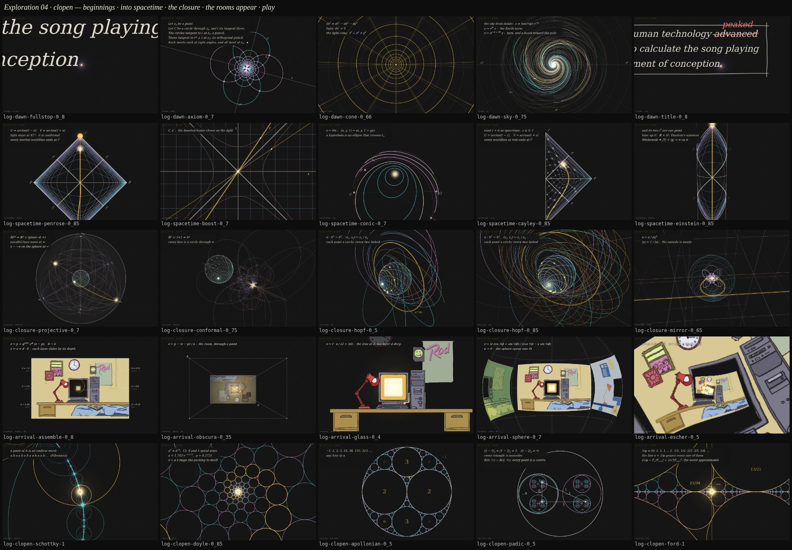

# Exploration 04: clopen

The second round on the blackboard. After round one (`docs/explore-03.md`)
the lead asked for more: _"maybe one where we see the projective closure of
space outside the sphere when we zoom out. some more that handle how the rooms
might first appear towards the end. some more ideas of beginnings. some more
ideas of projective transformations from the tunnel through to the
projective/mobius transformation into a clopen spacetime. some more just
playing with the math and the clopen geometry."_ Five new sketches, one for
each ask, twenty-four variants. Every frame is a pure function of its progress,
so `/lab?sketch=log-closure&v=hopf&at=0.85` pins one exactly.

**`/log`** indexes all of it — round one and round two in the run's order,
the new sketches marked. **`/v4?chain=clopen`** is the second reel: a
beginning, the orb, the tunnel, the way into spacetime, the closure, the room
appearing (61 s). **`/v4?chain=play`** plays the five films of play back to
back as one loop (50 s). Nothing here touches the runs.

## Clopen

A clopen set is closed and open at once. Two kinds of it run through the
round. The first is space closed up while staying open everywhere you stand —
the compactifications: the projective plane ℝP², projective space ℝP³, the
three-sphere S³ = ℝ³ ∪ {∞}, the torus, and the Penrose diagram, spacetime
with its infinities brought to a finite edge. The second is the topologist's:
sets so broken up that every piece of them is clopen — Cantor dust, the
limit sets of Möbius groups, the balls of the p-adic numbers.

And one fact ties the board to space-time: the Möbius maps of the sphere are
exactly the Lorentz transformations of spacetime acting on the sky,
PSL(2, ℂ) ≅ SO⁺(1, 3). The night sky is a Riemann sphere; a zoom into its pole,
`z ↦ e^{−η} z`, is a boost of rapidity η; a turn is a rotation. The tunnel the
swimmer flies down was a boost all along.

## The kit grew

What round one's sketches each wrote for themselves is in the kit now
(`src/lib/lab/log/`): `space.js` (a lens that orbits and can look straight
down, keyframed paths that only gather pace, a software depth buffer for
hidden lines on any surface, 3D lines cut at the lens and painted the plates'
way, the stereographic sphere), `ink.js` (the orb, lit points, the beat's
flash, Θ, ribbons, the lecture on a soft patch of board) and `rooms.js` (the
bedrooms loaded with their glass cut out, laid out in the plate's units and
drawn flat with their layers slid by depth). And `/lab` loads a sketch added
after the dev server started — the server here does not see new files, so in
dev it fetches one the glob does not know by its path.

## 1 · Beginnings — `log-dawn` (10 s)

From nothing to the orb the first question is asked under. No swimmer in any
of them. Every one ends exactly on the orb's first frame (pixel for pixel,
the orb's breathing carried across), so any of them can go in front of
`log-orb` without a seam.

- **`fullstop`** (the second reel's) — the title card's sentence written on
  the board under a ruled CONCEPTION CALCULATOR 2000, at the card's own pace;
  the full stop the PM asked for lands last, swells, lights, and IS the orb,
  and the lens zooms into it while the sentence streams out past the edges.
  The zoom is the strongest moment of the round. Best at 0.6, 0.8, 0.86.
- **`axiom`** — a proof. _Let z₀ be a point._ A chalk dot. _Let C be a circle
  through it._ Then every circle tangent at z₀ blooms out of the point in
  cyan, the perpendicular family in pink, crossing at right angles; ∎, and the
  point lights. The prettiest still; five lines is a lot to read in ten
  seconds. Best at 0.7.
- **`cone`** — a spacetime diagram: t up, x across, the gold light cone
  opening out of _here, now_. A song travels as a pulse along the past cone
  to arrive at the apex; _you_ climb out of it. Then the lens tips to look
  down the time axis — the cone end-on is rings round its apex: the tunnel,
  and the apex the orb. The strongest story: the song you were conceived to
  reaches the moment along the light cone. Best at 0.45, 0.55, 0.66.
- **`sky`** — the real night sky round the north celestial pole (the Plough,
  Cassiopeia, Vega …) as the Riemann sphere seen from inside. A long exposure:
  the Earth turns (`z ↦ e^{iθ}z`) and the stars trail into arcs, which are
  the log map's rings; a boost toward the pole joins the turn and the trails
  tighten into spirals pouring into the pole, which whitens into the orb. The
  most striking; the heaviest frame. Best at 0.15, 0.5, 0.75.
- **`title`** — the board as _Lecture 1_, the date top right, the sentence
  boxed in chalk and _advanced_ corrected to _peaked_ in red chalk; the same
  full-stop zoom. Its date is the clock's, the one thing in the round that is
  not purely a function of progress (it changes once a day).

## 2 · Into spacetime — `log-spacetime` (11–12 s)

The tunnel through projective and Möbius maps into spacetime closed up.
Every variant opens exactly on the tunnel's frame (`log-tunnel` `plane` at
0.85, measured to 0.31/255), keeps its clock and light, and ends on the lit
disc the turn ends on — at i⁺, future timelike infinity, in four of them.

- **`penrose`** (the second reel's) — the tunnel was a light cone seen from
  its apex: the net lifted onto the cone, the lens tips from end-on to
  side-on, and it is a spacetime diagram, the swimmer's path a worldline. Then
  `U = arctan(t − x), V = arctan(t + x)` squeezes the infinite plane into the
  Penrose diamond — i±, i⁰, ℐ± labelled, light still at 45°, because the
  squeeze is conformal — and the worldline runs into i⁺, which lights. The
  strongest of the five. Best at 0.3, 0.5, 0.7, 0.85.
- **`boost`** — the board curls into a small observer's sky and the zoom runs
  on as a boost: the sky drains off one pole and crowds into the other. Then
  a Minkowski diagram, the hyperbolae t² − x² = ±1 and the boosted axes t′,
  x′ closing on the light like scissors; squeezed into the diamond, t′ still
  ends at i⁺. Best at 0.45–0.5, 0.7, 0.8.
- **`conic`** — a homography brings the line at infinity into view, a chalk
  line across the board; the tunnel's circles become ellipses, a parabola,
  and hyperbolas whose two branches are one curve through infinity. Then the
  board closes up into ℝP², a dome with antipodes glued. Best at 0.5–0.58,
  0.85.
- **`cayley`** — the disc to the half-plane by a quarter turn of the sphere
  about ±i, `z ↦ (1 + z)/(1 − z)`, read as spacetime (r ≥ 0, t) and squeezed
  into the Penrose triangle, the net carried along. Best at 0.3, 0.45, 0.85.
- **`einstein`** — the tunnel was a cylinder: the log cylinder stood up as
  Einstein's static universe ℝ × S¹, Minkowski space the diamond
  |T| + |χ| < π on it, its two spatial infinities one point round the back.
  Best at 0.3, 0.72, 0.85.

## 3 · The closure — `log-closure` (10 s)

The lead's first ask: zoom out from the sphere and see the space outside it
close up. Each opens exactly where the turn's sphere stands (`log-mobius`
`sphere` at 0.44, measured to 1.2/255 — the net on the Riemann sphere, lit),
pulls back, and dives at a lit point.

- **`projective`** (the second reel's) — ℝP³. A cubic lattice is written out
  from the sphere in perspective, then the whole of space closes into a ball
  whose every line ends at two antipodal points of the sphere at infinity, all
  parallel lines sharing those ends (±∞ₓ, ±∞ᵧ, ±∞_z, labelled). A gold bead
  runs out of 0 through ∞ₓ, comes back in at −∞ₓ and home. Best at 0.6, 0.7,
  0.85; busy at 0.4–0.5.
- **`conformal`** — S³ = ℝ³ ∪ {∞}. The lattice lifted onto S³, turned in four
  dimensions, projected back: every line bends into a circle through one
  point, ∞, which comes into the picture from off the board and lights; the
  sphere stays round. Best at 0.6, 0.75, 0.9.
- **`hopf`** — the Hopf fibration, `S³ → S², (z₁, z₂) ↦ z₁/z₂`: every point
  of the sphere is a circle in the space round it, every two linked. Points
  light along a cyan arm and a pink one and their circles thread each other;
  a latitude lifts to a torus of gold circles; space fills with nested tori,
  drawn over and under like a knot diagram. The most beautiful frame of the
  round, at 0.85. Dense at 0.7–0.85.
- **`mirror`** — inversion in the sphere, `x ↦ x/|x|²`: the outside written
  again inside, a line touching the sphere answered by a circle through its
  centre; the centre lights and the lens dives through the glass. Best at 0.5,
  0.65, 0.95.

## 4 · The rooms appear — `log-arrival` (10 s)

How the room first comes into being: from the turn's lit disc to the frame
the fall lands on, the room on the board in its chalk plate, swaying on its
depths (`?decade=` picks the room).

- **`assemble`** — the six layers fly out of the light, each on its own
  golden spiral, the wall first and the bed last, each swaying at its depth as
  it lands — the parallax built as the room is; each depth chalked in the
  margin (d = 0.92 poster …), the light becoming the monitor's glass. Best at
  0.3, 0.8.
- **`obscura`** — the light is a pinhole: the room appears through it upside
  down, faint and small, rays chalked from its corners through the point, and
  turns the right way up as the lens comes through. The clearest lecture
  frame of the set, at 0.35.
- **`glass`** (the second reel's) — the monitor first: the light becomes the
  decade's glass, glowing, and the lens pulls back out of it while the room is
  put round it layer by layer — bezel, desk, poster, clock, the wall, the bed —
  with the pull-back's real parallax. The most cinematic; the answer's glass
  is where the room starts. Best at 0.15, 0.4, 0.55.
- **`sphere`** — the four decades' rooms on the Riemann sphere, a quarter turn
  apart; the sphere turns to bring the asked-for one round and flattens into
  the plate, the side rooms curling away. Best at 0.7.
- **`escher`** — the Print Gallery: the room nested in its own monitor and
  bent by `z ↦ z^α`, `α = (2πi + log λ)/2πi`, so the nested rooms are one
  twisting spiral, untwisting as the lens lands. Drawn per pixel at 360 px
  and upscaled, so soft; the twist is mild with the squarish glasses (λ ≈ 5–6).

## 5 · Play — `log-clopen` (10 s each)

Not a slot in the run: the clopen geometry for its own sake — a background, a
loading screen, a beat. Every film opens and ends on a lit point at the
centre, so they chain into one another and into any beat that does
(`/v4?chain=play`).

- **`schottky`** — Indra's pearls: four circles paired by two Möbius maps, the
  images nesting depth by depth into a Cantor dust (the limit set, clopen to
  the core); the circles grow until they kiss and the dust closes into a
  necklace; a Fibonacci word picks out one point and the lens pushes in.
- **`doyle`** — a Doyle spiral: every circle kisses six, centres on the
  lattice `aᵐbⁿ` with `a⁸ = b¹³` (solved at start, tangency to 4·10⁻¹⁶),
  zoomed by its own map `z ↦ az`, which takes the packing to itself.
- **`apollonian`** — the integral gasket (−1, 2, 2, 3 …) built generation by
  generation with Descartes' formula, then turned inside out into Coxeter's
  loxodromic spiral — four in a row always kiss, each φ + √φ times the next —
  and zoomed by it. The strongest blackboard frames of the round, at 0.3–0.5.
- **`padic`** — every ball is clopen: the 2-adic integers as discs in discs,
  every point of a ball its centre, every triangle isosceles, −1 = …1111₂, and
  a birthday's binary digits as a path down the tree, one level a step.
- **`ford`** — the Ford circles, kissing exactly when |ps − qr| = 1, and the
  line x = 1/φ grazing every Fibonacci convergent at 2/√5 of its radius — the
  worst-approximable number — zoomed into by φ¹³. The simplest and strongest.

## The joins, now

Round one's reel cut between beats. Round two's sketches were written to meet:
a beginning ends on the orb's first frame exactly; `log-spacetime` opens on the
tunnel's frame exactly; `log-closure` opens on the turn's sphere exactly;
`log-arrival` opens on the turn's lit disc and ends on the fall's landing. So
a run of them — fullstop, the orb, the tunnel, penrose, the room's glass — is
nearly one shot already. What still cuts: the orb to the tunnel (the swimmer
arrives); the lit i⁺, or the closure's lit point, to the room — the same gold
disc, but the lines round it vanish at the cut, and the room's sketch starts
it at rest where the one before ends it growing; and the closure's lens
starting at rest where the turn's was moving.

## Not looked at yet

Portrait; the reels running live on a phone. Frame costs measured headless:
most variants well under 25 ms; `log-closure` up to 40 ms (hopf's dive);
`log-spacetime` 60 fps at the median with a p95 of 33 ms in penrose and
boost; `log-arrival` within budget at a pixel ratio of 1 but 30–100 ms at 2
(the sphere's dive, obscura's turn). The board's maths face falls back to
the system serif (DejaVu here, Georgia or Cambria on a Mac); a webfont would
make it one face everywhere.

## What the kit wants next

From the five reports, the helpers that are still copied between sketches:
Möbius algebra in `C` (compose, invert, the image of a circle, the map taking
three points to three); batched circle drawing for the thousands of circles of
a gasket; a lens path re-timed by its own speed, so a camera only ever
gathers pace; over-and-under drawing for links and knots; the Penrose
machinery (the squeeze, the labelled diamond and triangle, the Einstein
cylinder); lecture lines that can replace one another in place, on a halo
rather than a patch over a room; `drawRoom` tiling its wall past the frame and
painting the board into the glass; and a hand-over state each sketch exports,
so the next one can open on it without copying its numbers.

## The asks, answered

| the lead's ask                                             | here                                                                 |
| ---------------------------------------------------------- | -------------------------------------------------------------------- |
| the projective closure of space outside the sphere         | `log-closure`: ℝP³, S³ = ℝ³ ∪ ∞, the Hopf fibration, inversion       |
| how the rooms might first appear towards the end           | `log-arrival`: assemble, obscura, glass, sphere, escher              |
| more ideas of beginnings                                   | `log-dawn`: the full stop, a proof, a light cone, the sky, a lecture |
| from the tunnel, by projective/Möbius maps, into spacetime | `log-spacetime`: Penrose, a boost, ℝP², Cayley, Einstein's universe  |
| playing with the maths and the clopen geometry             | `log-clopen`: Schottky, Doyle, Apollonian, 2-adic, Ford              |
