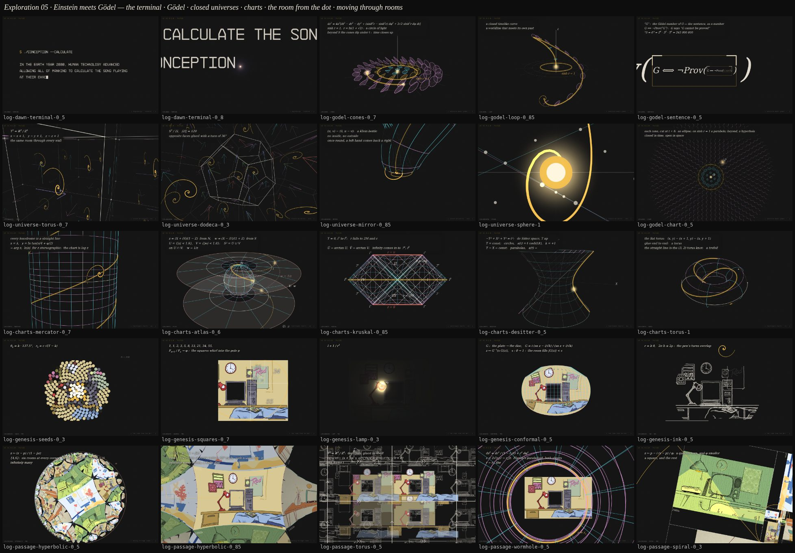

# Exploration 05: Einstein meets Gödel

The third round on the blackboard. The lead, on round two: _"all those are
interesting. i especially like the one of how it generated the room from the
dot, that was super neat"_ — and for this round: _"go away and make more.
using these as your inspiration. more dealing with clopen space. think
einstein meets gödel. more ways of having rooms appear. or moving through
separate rooms. more coordinate charts. all that kinda stuff."_ Plus three
asks on what was there: redo the title beginning as terminal typing, index
everything, and a small bar to step between experiments.

Five new sketches, twenty-two variants (and the title beginning redone), every frame a pure function of its
progress (`/lab?sketch=log-godel&v=loop&at=0.85` pins one). And three things
round the sketches: **`/log`** now indexes every experiment there has been
(the board's three rounds, the reels, explore 01 and 02, the v4 rough cut,
the workshop, the runs — one list, `data/experiments.js`); a small bar in the
bottom right of the lab, the reels and the index steps to the previous and
next experiment and holds a list of all of them; and **`/cut`** plays
everything there is, one variant of each beat in the run's order, on one
page — fourteen beats, 143 s today, and a beat that lands in the
registry is in the cut.

## The title, as a terminal

The title beginning was too much a title slide. It is a terminal now
(`log-dawn` `terminal`): a block caret blinking on the clock, the site's own
mono face, `$ ./conception --calculate` typed at a keystroke rhythm (jittered,
a hitch after every space, longer after punctuation, a pause before the last
word), the three lines of the card printed as its output — and the full stop
is the last keystroke: the caret closes to the dot, the dot lights into the
orb, and the lens zooms into it as the first beginning does, the lines
streaming out past the edges, ending on the orb's first frame exactly. It is
the beginning the cut opens on.

## 1 · Einstein meets Gödel — `log-godel` (11–12 s)

In 1949 Gödel gave Einstein, for his seventieth birthday, a solution of
Einstein's own equations: a rotating universe in which time closes up. In his
cylindrical chart, `ds² = 4a²[dt² − dr² − dy² + (sinh⁴r − sinh²r) dφ² +
2√2 sinh²r dφ dt]`; the circle of constant t and r is null where sinh r = 1
and timelike beyond, so round the axis, far enough out, runs a path into the
past. Closed in time, open in space: clopen spacetime. The maths is checked
against the metric in every variant.

- **`cones`** — Hawking and Ellis's picture: t up, the light cones on a
  lattice out from the axis, cyan inside, gold on the circle of light, pink
  beyond — each drawn as the elliptic cone the metric makes it, leaning
  toward φ as r grows, touching the plane on the circle, dipping under it
  beyond — and a bead running round a closed timelike curve. Best at 0.3,
  0.6, 0.7.
- **`loop`** (the cut's) — the swimmer's worldline climbs out of the lit
  event, spirals out past the circle, turns down in t and comes round to
  arrive at the event from its own future, threading the cones it leaves
  behind: a worldline that meets its own past, timelike and future-pointing
  throughout (checked at a thousand points). Best at 0.5, 0.7, 0.85.
- **`chart`** — the (r, φ) chart from above, each cone cut by t: an ellipse
  inside, a parabola on the circle, a hyperbola beyond. The universe is
  homogeneous, so re-centred on another point the chart is the same chart:
  every point is the centre. (Not self-similar: Gödel's universe has a
  scale, so there is no "same at every zoom", and the sketch does not
  pretend one.) Best at 0.3, 0.5.
- **`sentence`** — Gödel's other idea, self-reference, as the Droste it is:
  `G ⟺ ¬Prov(⌜G⌝)`, with ⌜G⌝ a box holding G, which holds a box holding G …
  zoomed into for ever; a birthday's Gödel number, all 41 digits. Best at
  0.3, 0.5, 0.85.

## 2 · Closed universes — `log-universe` (11 s)

Spaces with no edge and finite volume, closed yet open wherever you stand,
seen from inside: each opens on a chart of itself drawn in ordinary space
and the lens flies into the chart's centre, where the drawing becomes the
honest first-person view.

- **`torus`** (the cut's) — T³: a cube with opposite faces glued, and from
  inside a lattice of the same room in every direction, the swimmer seen
  again and again; straight ahead, yourself from behind. Best at 0.7, 0.9.
- **`dodeca`** — Poincaré's dodecahedral space, S³/2I, built from the
  120-cell: opposite faces glued with a tenth of a turn, the twelve
  neighbours the one cell, turned. Best at 0.15, 0.3, 0.7.
- **`mirror`** — a Klein bottle: the swimmer carried once round through the
  seam comes back to its start as its own mirror image over a ghost of
  itself. A left hand comes back a right. Best at 0.5, 0.85.
- **`sphere`** — Einstein's S³ in the stereographic chart from where you
  stand: the swimmer shrinks to the equator, grows again past it, and from
  the far pole its spiral fills the sky. Walk far enough and you come home.
  Best at 0.15, 0.85, 1.

## 3 · Coordinate charts — `log-charts` (11–12 s)

A space is covered by charts, flat maps of pieces of it; closed in one
chart, open in the next.

- **`mercator`** (the cut's) — the sphere with the gold loxodrome projected
  onto the cylinder and unrolled into Mercator's chart, which is log z of
  the stereographic plane: the graticule a square grid, every loxodrome a
  straight line the swimmer races up, through the seam and off the top. The
  poles at y = ±∞: the sphere closed, its chart open. Best at 0.3, 0.7, 1.
- **`atlas`** — the Riemann sphere in two charts, from N and from S, a lit
  point riding over it, leaving one chart's edge for the other's middle;
  `w = 1/z` on the overlap. Two open discs, one closed sphere. Best at 0.5,
  0.85.
- **`kruskal`** — one black hole, three charts: Schwarzschild's wall at
  r = 2M where the light rays pile up, Kruskal's four regions with the
  horizon at 45°, the Penrose diagram, and the T = 0 slice lifting off the
  board into Flamm's paraboloid, the Einstein–Rosen bridge, its throat lit.
  Best at 0.3, 0.7, 0.85, 1.
- **`desitter`** — the hyperboloid sliced three ways: circles (closed,
  k = +1), parabolas (flat, k = 0), hyperbolas (open, k = −1). Closed, flat,
  open: it depends on the chart. Best at 0.3, 0.5, 0.85.
- **`torus`** — the flat torus as a glued square the swimmer leaves on the
  right and re-enters on the left, rolled into a tube and glued; its
  straight line the (3, 2) trefoil. Best at 0.15, 0.5, 1.

## 4 · The room from the dot — `log-genesis` (10 s)

Five more generations of the room out of the lit dot, each by a piece of the
board's own maths, every one opening on the dot and ending on the landed
room swaying on its depths.

- **`seeds`** — Vogel's sunflower: seed k at k · 137.5°, pouring out of the
  dot, more and smaller, the room coming up at rising resolution — a
  handful of gold seeds, a seed head, a halftone, the picture. Best at 0.15,
  0.3, 0.5.
- **`squares`** — the plate is a golden rectangle, so it is its whirling
  squares: the Fibonacci squares grow out of the pole smallest first, each
  revealing its piece of the room with its gold quarter-arc. Best at 0.5,
  0.7.
- **`lamp`** — darkness, and the dot is the lamp's bulb: the room lit by
  1/r², the far corners last, the desk and bed casting shadows. The bulb
  lighting the monitor and clock out of the dark is the best single frame
  of the set, at 0.3.
- **`conformal`** — the room squeezed into a disc by Jacobi's sn (the exact
  rectangle-to-disc map, `log/genesis-sn.js`) and relaxed to the plate
  through the squircles between, the plate's net riding the map. Best at
  0.3, 0.5.
- **`ink`** — the swimmer's tail is a pen: the room's ink lines appear under
  it along a spiral, then the colour floods in, the wall last. The sperm
  draws the room it was conceived in. Best at 0.3, 0.5, 0.7.

## 5 · Moving through rooms — `log-passage` (12 s)

Many rooms in other geometries, each closed and open at once, the lens
moving through them to land in the one asked for. All four land exactly as
the fall lands.

- **`hyperbolic`** (the cut's) — the Circle Limit of rooms: the Poincaré disc
  tiled by hyperbolic golden rectangles (every angle 60°, six at a corner,
  sides in the golden ratio), a room drawn into every curved tile through
  the Klein model, the lens a Möbius translation along a geodesic through
  three rooms, the centre tile flattening into the plate. Infinitely many
  rooms, a finite disc. The picture of the round. Best at 0.3, 0.5, 0.7.
- **`torus`** — the room glued to itself, T³: from inside, its lattice of
  copies in chalk, the colour flowing into the copy the lens enters, a bed
  that runs past its cell running into the next, every copy's glass opening
  onto its own back. Best at 0.15, 0.3, 1.
- **`wormhole`** — two rooms joined by an Einstein–Rosen bridge: Flamm's
  paraboloid behind the first room's glass, the lens down it, through the
  gold throat r = r_s and out of the other room's glass. The funnel is
  shallow, as Flamm's is, so it reads as rings sweeping past rather than a
  long tunnel. Best at 0.3, 0.5, 1.
- **`spiral`** — rooms as the golden rectangle's squares, each a quarter turn
  and φ smaller, the lens riding that similarity through four of them while
  the spiral through their corners stands still on screen. The cheapest
  variant, and exact. Best at 0.15, 0.3, 1.

## The cut

`/cut` is the run as it stands, one variant of each beat, in order: the
terminal, the orb, the Fibonacci swimmer, the tunnel, the beat, the Penrose
diamond, the sphere, ℝP³, Gödel's loop, the 3-torus, Mercator's chart,
the Circle Limit of rooms, the room assembled out of the dot, the fall. It is too long to be
the run — the run wants three transitions, not fourteen beats — but it is
every candidate in its place, on one page, to pick from.

## Not looked at yet

Portrait; the reels running live on a phone. Frame costs measured headless:
`log-godel` under 9 ms; `log-universe` 16–28 ms; `log-charts` 17–23 ms;
`log-genesis` under 25 ms; `log-passage` under 12 ms in flight, 23 ms as the disc fades. The dev server here does not see
files added after it starts, so the lab and the reel now fetch an unlisted
sketch by its path in dev.

## What the kit wants next

Three sketches now carry a copy of the same pace re-timer (a lens path
re-timed by its own apparent speed, so a camera only ever gathers pace);
four carry slot-based captions that replace one another in place; three
carry the way-on disc; two carry a posed swimmer drawn through an arbitrary
map; two carry the Penrose squeeze. Those five go into the kit next, with a
3D cone with a convex-solid hidden test, batched line ink for lattices of a
thousand lines, a room flattened into one image with its glass lit, and
`genesis-sn.js` as the kit's `elliptic.js`.

## The asks, answered

| the ask                                      | here                                                                  |
| -------------------------------------------- | --------------------------------------------------------------------- |
| redo the title beginning as terminal typing  | `log-dawn` `terminal`                                                 |
| the index with all of the previous and these | `/log`, from `data/experiments.js`                                    |
| a very small non-invasive bar to select      | `components/LabBar.svelte`, bottom right of the lab, reels and index  |
| a cut of all we have on one page             | `/cut`                                                                |
| Einstein meets Gödel                         | `log-godel`: cones, loop, chart, sentence                             |
| more clopen space                            | `log-universe`: T³, the dodecahedral space, a Klein bottle, S³        |
| more coordinate charts                       | `log-charts`: Mercator, the atlas, Kruskal, de Sitter, the flat torus |
| more ways of having rooms appear             | `log-genesis`: seeds, squares, lamp, conformal, ink                   |
| moving through separate rooms                | `log-passage`: the Circle Limit, T³, a wormhole, the golden squares   |
