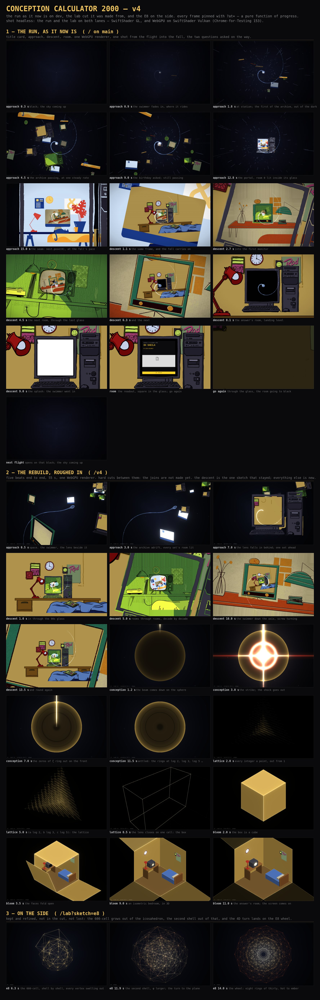

# The flow, as it stands

Three sections, all shot headless and all pinned with `?at=` — every scene is a
pure function of its own progress, so each frame is the frame the run would
have drawn at that moment rather than a timed guess at it.

**1 — the run, as it now is.** What `/` does on `main`: a title card over an
approach held at zero, black; the card lifts, the sky comes up, the swimmer
fades in where it rides, ahead of the lens and seen from behind; then the
archive comes out of the dark and passes, each piece at its own moment of the
flight so it comes by at one steady rate, the two questions are asked on the
way and the flight held while they are; the portal dead ahead,
whose glass holds the first room; the descent through the decades, one room
inside the next, at one pace from the seam, down to the answer's room, which
lands level; the swimmer going into its screen and the screen going white; the
readout in that glass; and "go again" flying home through the glass into black,
which is the black the next flight opens on. One WebGPU renderer, and one shot
from the flight into the fall — the approach ends on the frame the descent
opens on, at the speed the descent opens at. Frames on the WebGL lane at
`?seed=1`, so the decades and the archive fall the same way on every load.

| scene    | seconds | where                                               |
| -------- | ------- | --------------------------------------------------- |
| approach | 15      | `three/world/approach.js`, held at the two asks     |
| descent  | 9       | `three/world/descent.js` over `three/world/nest.js` |
| room     | —       | `scenes/Room.svelte`, until "go again"              |

**2 — the lab cut it was made from.** The five sketches chained at `/v4`,
55 s, from the round before: the approach and the descent were the two that were
bought, and are what the run above is built from; the conception, the lattice
and the bloom stay in the lab.

**3 — on the side.** The E8 expansion, kept and refined at `/lab?sketch=e8`
though not in the cut.

## Reproducing the page

    npm run dev
    BASE=http://localhost:3000 OUT=<dir> \
      PLAN='[["2",[0.02,0.06,0.12,0.3,0.6,0.85,1]],["3",[0.12,0.3,0.5,0.7,0.9,1]]]' \
      node scripts/shots.mjs

for the run (`2` approach, `3` descent — the shots tool waits for the stage's
warm-up and presses the key); the room and the way home are a real run driven
the way `scripts/verify.mjs` drives it. The second section is the same `?at=`
pins against `/v4` on the WebGPU lane (`LANE=webgpu`, `scripts/lane.mjs`), the
third against `/lab?sketch=e8`. The page itself was composed in the scratchpad —
it is a picture of the work, not part of the build.
